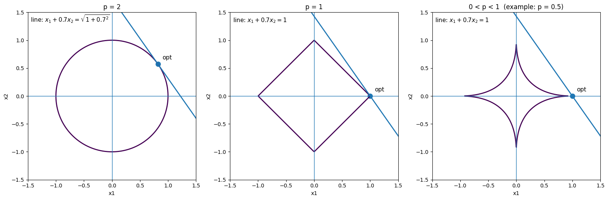

> [!Abstract] Week1
> 

> [!FAQ] 1.1
> 考虑稀疏优化问题，我们已经直观地讨论了在 $l_0$、$l_1$、$l_2$ 三种范数下问题的解的可能形式。针对一般的 $l_p$ “范数”：
>
> $$
> \|x\|_p \overset{\mathrm{def}}{=} \left( \sum_{i=1}^n |x|^p \right)^{1/p}, \quad 0 < p < 2,
> $$
> 
> 我们考虑优化问题
> 
> $$
> \min \quad \|x\|_p,
> $$
> 
> $$
> \text{s.t.} \quad Ax = b.
> $$
> 
> 试着用几何直观的方式（类似于图 1.2）来说明当 $p \in (0,2)$ 取何值时，该优化问题的解可能具有稀疏性。

考虑二维情形 $x=(x_1,x_2)$。此时约束 $Ax=b$ 可以看成平面上的一条直线，而目标函数 $|x|_p$ 的等值线满足

$$
|x_1|^p+|x_2|^p=c^p.
$$

要求

$$
\min |x|_p \quad \text{s.t. } Ax=b
$$

可以从几何上理解为：让等值线从小到大逐渐扩张，第一次与约束直线接触的点，就是最优解。

**用到的结论：**
最小值通常出现在“最小的一条还能与约束集合相交的等值线”上。

当 $p=2$ 时，

$$
|x_1|^2+|x_2|^2=c^2,
$$

等值线是圆。圆的边界是光滑的，没有尖角，所以它与约束直线的接触点一般不会落在坐标轴上，因此最优解通常不稀疏。

当 $p=1$ 时，

$$
|x_1|+|x_2|=c,
$$

等值线是菱形。菱形在坐标轴方向上有尖角，如 $(c,0)$、$(0,c)$ 等点。这些点都有一个分量为 $0$，因此如果约束直线先碰到这些尖角，得到的最优解就是稀疏的。

当 $0<p<1$ 时，

$$
|x_1|^p+|x_2|^p=c^p,
$$

等值线在坐标轴附近比 $p=1$ 时更尖。于是约束直线更容易先与坐标轴附近的点接触，所以最优解更容易出现某些分量为 $0$ 的情况，即稀疏性更强。

因此，从几何直观上看：

$$
0<p\le 1
$$

时，该优化问题的解可能具有稀疏性；其中

$$
0<p<1
$$

时稀疏性通常更明显。而当

$$
1<p<2
$$

时，等值线较光滑，一般不容易得到稀疏解。

*示例图如下*

几何上，求最小值就相当于把紫色曲线按比例缩小或放大，直到它**第一次碰到**那条蓝色直线。第一次碰到的点，就是最优解。

图中紫色曲线表示 $|x|_p$ 的等值线，蓝色直线表示约束 $Ax=b$。最优解对应等值线与约束直线的首次接触点。$p=2$ 时边界光滑，接触点一般不在坐标轴上；$p=1$ 时出现顶点，$0<p<1$ 时尖角更明显，因此接触点更容易落在坐标轴上，从而解更可能稀疏。

---

> [!FAQ] 1.3(a)
> 试给出如下点列的 Q-收敛速度：
> $$
> x^k=\frac{1}{k!},\ k=1,2,\cdots;
> $$

已知
$$
x^k=\frac{1}{k!},\quad k=1,2,\cdots
$$

因为 $k!\to+\infty$，所以
$$
x^k=\frac{1}{k!}\to 0
$$

故极限点为
$$
x^*=0
$$

记误差为
$$
e_k=|x^k-x^*|=\frac{1}{k!}
$$

由 **Q-超线性收敛的定义**：若
$$
\lim_{k\to\infty}\frac{e_{k+1}}{e_k}=0
$$
则称点列 Q-超线性收敛。

下面计算：
$$
\frac{e_{k+1}}{e_k}
=
\frac{1/(k+1)!}{1/k!}
=
\frac{k!}{(k+1)!}
=
\frac{1}{k+1}
$$

所以
$$
\lim_{k\to\infty}\frac{e_{k+1}}{e_k}
=
\lim_{k\to\infty}\frac{1}{k+1}
=
0
$$

因此，这个点列是 **Q-超线性收敛**。

又由 **Q-$p$ 阶收敛的定义**：若存在常数 $\mu\in(0,+\infty)$，使
$$
\lim_{k\to\infty}\frac{e_{k+1}}{(e_k)^p}=\mu
$$
则称其为 Q-$p$ 阶收敛。

这里
$$
\frac{e_{k+1}}{(e_k)^p}
=
\frac{1/(k+1)!}{(1/k!)^p}
=
\frac{(k!)^{p-1}}{k+1}
$$

当 $p>1$ 时，因 $k!$ 增长很快，上式趋于 $+\infty$，不可能等于某个正常数 $\mu$。

所以它 **不是任何 $p>1$ 的 Q-$p$ 阶收敛**。

**结论：**
$$
x^k=\frac{1}{k!}
$$
的 Q-收敛速度是 **Q-超线性收敛**。