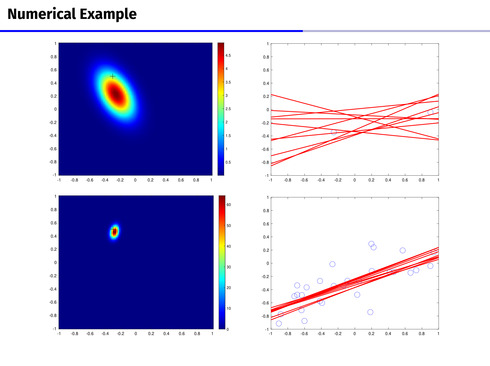
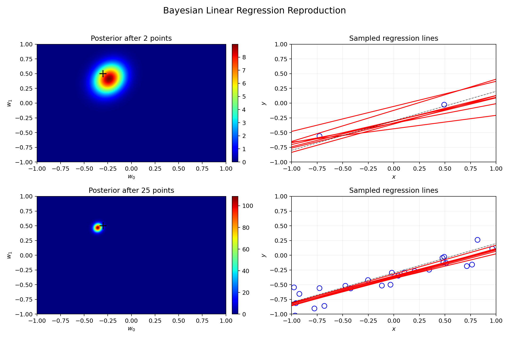
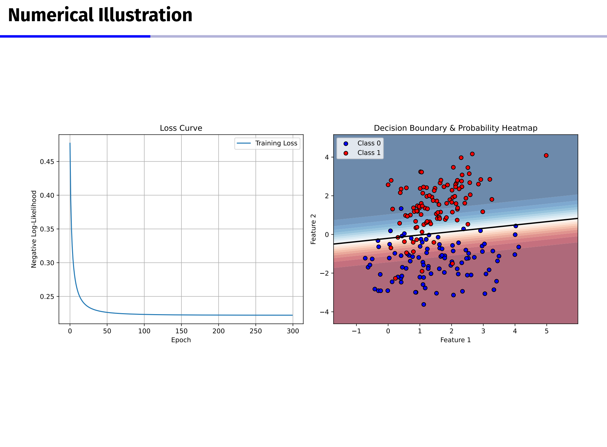
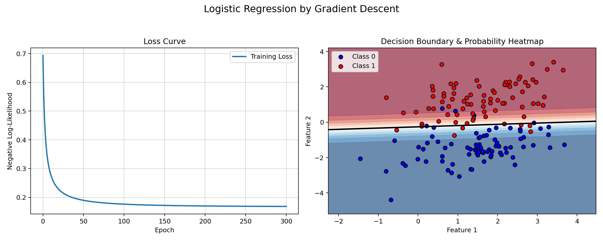

> [!FAQ] 1 (10 pts)
> Suppose we have $n$ independent $y_i \sim N(\mu,\sigma_i^2)$, where $\sigma_i^2=\sigma^2v_i$ with known $v_i$. Use least-squares and weighted least-squares respectively to find an estimation of $\mu$ and give a particular example to compare these two estimators.

**第一步：先写普通最小二乘的目标函数**

普通最小二乘没有考虑每个 $y_i$ 的方差大小，所以直接让所有点到 $\mu$ 的平方距离之和最小。

$$
Q(\mu)=\sum_{i=1}^{n}(y_i-\mu)^2
$$

对 $\mu$ 求导：

$$
\frac{dQ(\mu)}{d\mu}=-2\sum_{i=1}^{n}(y_i-\mu)
$$

令导数为 $0$：

$$
\sum_{i=1}^{n}(y_i-\mu)=0
$$

展开：

$$
\sum_{i=1}^{n}y_i-n\mu=0
$$

移项：

$$
n\mu=\sum_{i=1}^{n}y_i
$$

所以普通最小二乘得到的估计量是：

$$
\hat{\mu}_{LS}=\frac{1}{n}\sum_{i=1}^{n}y_i
$$

也就是样本平均数。

**第二步：再写加权最小二乘的目标函数**

题目中给出 $\sigma_i^2=\sigma^2v_i$，其中 $v_i$ 已知。
如果某个 $v_i$ 大，说明这个观测值方差大，不太稳定，权重应该小一些。
严格地说，逆方差权重应该和

$$
\frac{1}{\sigma_i^2}=\frac{1}{\sigma^2v_i}
$$

成正比。因为 $\frac{1}{\sigma^2}$ 是公共常数，不影响最小化结果，所以常用权重取：

$$
w_i=\frac{1}{v_i}
$$

加权最小二乘的目标函数写成：

$$
Q_w(\mu)=\sum_{i=1}^{n}\frac{(y_i-\mu)^2}{v_i}
$$

对 $\mu$ 求导：

$$
\frac{dQ_w(\mu)}{d\mu}=-2\sum_{i=1}^{n}\frac{y_i-\mu}{v_i}
$$

令导数为 $0$：

$$
\sum_{i=1}^{n}\frac{y_i-\mu}{v_i}=0
$$

把括号拆开：

$$
\sum_{i=1}^{n}\frac{y_i}{v_i}-\mu\sum_{i=1}^{n}\frac{1}{v_i}=0
$$

移项后得到：

$$
\mu\sum_{i=1}^{n}\frac{1}{v_i}=\sum_{i=1}^{n}\frac{y_i}{v_i}
$$

所以加权最小二乘得到的估计量是：

$$
\hat{\mu}_{WLS}=\frac{\sum_{i=1}^{n}\frac{y_i}{v_i}}{\sum_{i=1}^{n}\frac{1}{v_i}}
$$

也就是按照 $1/v_i$ 做权重的加权平均。

**第三步：举一个具体例子比较**

取一个很简单的例子：

$$
n=2
$$

$$
y_1=10,\quad y_2=20
$$

$$
v_1=1,\quad v_2=9
$$

这里 $y_1$ 的方差比较小，$y_2$ 的方差比较大，所以 $y_1$ 应该更可信一些。

普通最小二乘估计为：

$$
\hat{\mu}_{LS}=\frac{10+20}{2}
$$

算出来：

$$
\hat{\mu}_{LS}=15
$$

加权最小二乘估计为：

$$
\hat{\mu}_{WLS}=\frac{\frac{10}{1}+\frac{20}{9}}{\frac{1}{1}+\frac{1}{9}}
$$

先算分子：

$$
\frac{10}{1}+\frac{20}{9}=\frac{110}{9}
$$

再算分母：

$$
\frac{1}{1}+\frac{1}{9}=\frac{10}{9}
$$

所以：

$$
\hat{\mu}_{WLS}=\frac{110}{10}
$$

算出来：

$$
\hat{\mu}_{WLS}=11
$$

**第四步：比较两个结果**

普通最小二乘得到 $15$，它把 $10$ 和 $20$ 看得一样重要。

加权最小二乘得到 $11$，它更靠近 $y_1=10$，因为 $v_1=1$ 比 $v_2=9$ 小，说明第一个观测值更稳定。

如果进一步比较方差，普通最小二乘估计量的方差是

$$
\operatorname{Var}(\hat{\mu}_{LS})
=
\frac{\sigma^2}{n^2}\sum_{i=1}^{n}v_i.
$$

而加权最小二乘估计量的方差是

$$
\operatorname{Var}(\hat{\mu}_{WLS})
=
\frac{\sigma^2}{\sum_{i=1}^{n}1/v_i}.
$$

由 Cauchy-Schwarz 不等式

$$
\left(\sum_{i=1}^{n}v_i\right)
\left(\sum_{i=1}^{n}\frac1{v_i}\right)
\ge n^2
$$

可以得到

$$
\operatorname{Var}(\hat{\mu}_{WLS})
\le
\operatorname{Var}(\hat{\mu}_{LS}),
$$

并且等号只在所有 $v_i$ 相等时成立。
所以在方差不同且 $v_i$ 已知的情况下，加权最小二乘更有效；在正态假设下，它也等价于最大似然估计。普通最小二乘仍然是无偏的，但通常不是最有效的。

在上面的例子中，

$$
\operatorname{Var}(\hat{\mu}_{LS})=\frac{10}{4}\sigma^2=2.5\sigma^2,
\qquad
\operatorname{Var}(\hat{\mu}_{WLS})=\frac{9}{10}\sigma^2=0.9\sigma^2.
$$

这也说明加权最小二乘在这个例子里方差更小。前面两个估计值 $15$ 和 $11$ 只是一次观测下的数值展示，真正比较估计量好坏时，主要还是看它们的方差和效率。

---

> [!FAQ] 2 (20 pts)
> Try to reproduce the figure on page 29 of lecture 1 about Bayesian linear regression, where the ground truth model is
> $$
> f(x)=-0.3+0.5x+\varepsilon,
> $$
> where $\varepsilon$ represents zero mean Gaussian noise. You are free to test different variances.


lecture1 的 29 页图

**第一步：先写 Bayesian linear regression 的模型**

题目给出的真实模型是

$$
y=-0.3+0.5x+\varepsilon,
\qquad
\varepsilon\sim N(0,\sigma^2).
$$

为了和图里一样画出参数空间中的后验分布，把截距和斜率写成一个参数向量：

$$
w=
\begin{pmatrix}
w_0\\
w_1
\end{pmatrix},
\qquad
\phi(x)=
\begin{pmatrix}
1\\
x
\end{pmatrix}.
$$

于是模型可以写成

$$
y_i=w^T\phi(x_i)+\varepsilon_i.
$$

这里真实参数是

$$
w_0=-0.3,
\qquad
w_1=0.5.
$$

我这里取噪声标准差为

$$
\sigma=0.15,
\qquad
\sigma^2=0.0225.
$$

代码里固定随机种子为 $20260428$，并从 $[-1,1]$ 上均匀生成 $x_i$，这样每次运行都能得到同一张图。

**第二步：写出先验和后验更新公式**

给参数一个二维正态先验。这里采用零均值、各向同性的先验。零均值先验不是说真实参数一定接近 $0$，而是在没有数据之前给参数一个对称、弱信息的默认假设：

$$
w\sim N(0,\alpha^{-1}I).
$$

本次实验取 $\alpha=2.0$，也就是先验协方差为 $0.5I$，先验强度比较温和。

如果记

$$
\beta=\frac{1}{\sigma^2},
$$

并把所有样本的设计矩阵写成

$$
\Phi=
\begin{pmatrix}
1 & x_1\\
1 & x_2\\
\vdots & \vdots\\
1 & x_n
\end{pmatrix},
$$

那么 Bayesian linear regression 的后验仍然是正态分布：

$$
w\mid y\sim N(m_N,S_N).
$$

其中

$$
S_N^{-1}=\alpha I+\beta\Phi^T\Phi,
$$

$$
m_N=\beta S_N\Phi^Ty.
$$

这是零均值先验 $m_0=0$、$S_0=\alpha^{-1}I$ 下的形式。一般地，如果先验写成 $w\sim N(m_0,S_0)$，那么

$$
S_N^{-1}=S_0^{-1}+\beta\Phi^T\Phi,
\qquad
m_N=S_N(S_0^{-1}m_0+\beta\Phi^Ty).
$$

这个公式就是代码里更新后验分布的核心。

**第三步：用 Python 复现这张图**

我先用 2 个点更新一次后验，再用 25 个点更新一次后验。
其中 2 个点选得相隔较远一些，是为了让第一行图里后验的不确定性更容易看出来。
左边画的是参数 $(w_0,w_1)$ 的后验密度，右边画的是从后验中抽出的若干条回归直线。
黑色虚线是真实直线，参数图里的黑色加号是真实参数 $(-0.3,0.5)$。

代码如下：

```python
from pathlib import Path
import numpy as np
import matplotlib
matplotlib.use("Agg")
import matplotlib.pyplot as plt

assets = Path("assets/hw1")
assets.mkdir(parents=True, exist_ok=True)

rng = np.random.default_rng(20260428)
true_w = np.array([-0.3, 0.5])
sigma = 0.15
beta = 1 / sigma**2
alpha = 2.0

x_all = np.sort(rng.uniform(-1.0, 1.0, 25))
y_all = true_w[0] + true_w[1] * x_all + rng.normal(0, sigma, size=x_all.size)

idx_small = np.array([5, 19])
x_small = x_all[idx_small]
y_small = y_all[idx_small]


def posterior(x, y):
    Phi = np.column_stack([np.ones_like(x), x])
    S_inv = alpha * np.eye(2) + beta * Phi.T @ Phi
    S = np.linalg.inv(S_inv)
    m = beta * S @ Phi.T @ y
    return m, S


def gaussian_pdf_grid(m, S, w0_grid, w1_grid):
    W0, W1 = np.meshgrid(w0_grid, w1_grid)
    D0 = W0 - m[0]
    D1 = W1 - m[1]
    invS = np.linalg.inv(S)
    quad = invS[0, 0] * D0**2 + 2 * invS[0, 1] * D0 * D1 + invS[1, 1] * D1**2
    norm = 1.0 / (2 * np.pi * np.sqrt(np.linalg.det(S)))
    return norm * np.exp(-0.5 * quad)


m_small, S_small = posterior(x_small, y_small)
m_all, S_all = posterior(x_all, y_all)

w0_grid = np.linspace(-1, 1, 220)
w1_grid = np.linspace(-1, 1, 220)
x_line = np.linspace(-1, 1, 200)

fig, axes = plt.subplots(2, 2, figsize=(12, 8))
rows = [
    (x_small, y_small, m_small, S_small, "Posterior after 2 points"),
    (x_all, y_all, m_all, S_all, "Posterior after 25 points"),
]

for r, (x_obs, y_obs, m, S, title) in enumerate(rows):
    Z = gaussian_pdf_grid(m, S, w0_grid, w1_grid)

    ax = axes[r, 0]
    im = ax.imshow(Z, extent=[-1, 1, -1, 1], origin="lower", cmap="jet", aspect="auto")
    ax.plot(true_w[0], true_w[1], marker="+", color="black", markersize=12, mew=1.5)
    ax.set_title(title)
    ax.set_xlabel("$w_0$")
    ax.set_ylabel("$w_1$")
    ax.set_xlim(-1, 1)
    ax.set_ylim(-1, 1)
    fig.colorbar(im, ax=ax, fraction=0.046, pad=0.03)

    ax = axes[r, 1]
    sampled_w = rng.multivariate_normal(m, S, size=8)
    for w in sampled_w:
        ax.plot(x_line, w[0] + w[1] * x_line, color="red", lw=1.4)
    ax.scatter(x_obs, y_obs, facecolors="none", edgecolors="blue", s=70, linewidths=1.1)
    ax.plot(x_line, true_w[0] + true_w[1] * x_line, color="black", ls="--", lw=1.0, alpha=0.6)
    ax.set_title("Sampled regression lines")
    ax.set_xlabel("$x$")
    ax.set_ylabel("$y$")
    ax.set_xlim(-1, 1)
    ax.set_ylim(-1, 1)
    ax.grid(alpha=0.18)

fig.suptitle("Bayesian Linear Regression Reproduction", fontsize=15)
fig.tight_layout(rect=[0, 0, 1, 0.96])
fig.savefig(assets / "faq2_bayesian_linear_regression.png", dpi=180)
plt.close(fig)

print("posterior mean after 2 points:", np.round(m_small, 4))
print("posterior mean after 25 points:", np.round(m_all, 4))
print("posterior covariance after 25 points:\n", np.round(S_all, 5))
```

运行后得到的主要数值是：

$$
m_2=(-0.2390,\ 0.4130)^T,
$$

$$
m_{25}=(-0.3583,\ 0.4674)^T.
$$

25 个点之后，后验均值总体上已经接近真实参数 $(-0.3,0.5)$，同时后验协方差明显变小。
后验协方差为

$$
S_{25}=\begin{pmatrix}
0.00091 & 0.00013\\
0.00013 & 0.00236
\end{pmatrix}.
$$

所以后验分布会比只用 2 个点时集中很多。

**第四步：复现图像**



从图中可以看到，只用 2 个点时，参数后验还比较分散，所以右上角抽出来的红色直线差别比较大。
当样本数增加到 25 个之后，在本次随机数据下，参数后验明显收缩，并且集中在真实参数附近，右下角抽出来的红色直线也基本贴近真实直线。

这说明 Bayesian linear regression 的特点是：数据越多，后验不确定性越小；在图像上就表现为左边的后验密度越来越集中，右边的候选回归直线越来越接近。


---


> [!FAQ] 3 (10 pts)
> Compute the solution of the following weighted least-squares problem
> $$
> \min_{\beta}\sum_{i=1}^{n}w_i(x_i^{T}\beta-y_i)^2
> $$
> where $w_i>0$.

**第一步：先把目标函数写清楚**

设目标函数为：

$$
Q(\beta)=\sum_{i=1}^{n}w_i(x_i^{T}\beta-y_i)^2
$$

这里 $x_i$ 是第 $i$ 个样本对应的向量，$\beta$ 是要求的参数向量。
如果 $x_i\in\mathbb R^p$，那么 $\beta\in\mathbb R^p$，后面构造出来的 $X$ 就是一个 $n\times p$ 的矩阵。
因为 $w_i>0$，所以每一项都是非负的平方项乘正数。

**第二步：把它写成矩阵形式**

把所有 $x_i^T$ 按行放在一起，记为矩阵 $X$：

$$
X=
\begin{pmatrix}
x_1^T \\
x_2^T \\
\vdots \\
x_n^T
\end{pmatrix}
$$

再记：

$$
y=
\begin{pmatrix}
y_1 \\
y_2 \\
\vdots \\
y_n
\end{pmatrix}
$$

权重矩阵写成对角矩阵：

$$
W=\operatorname{diag}\{w_1,w_2,\cdots,w_n\}
$$

因为每个 $w_i>0$，所以 $W$ 是正定的对角矩阵。也可以写成

$$
X^TWX=(W^{1/2}X)^T(W^{1/2}X),
$$

因此 $X^TWX\succeq0$。

这样每个残差是 $x_i^T\beta-y_i$，整体残差向量就是：

$$
X\beta-y
$$

所以原来的目标函数可以写成：

$$
Q(\beta)=(X\beta-y)^TW(X\beta-y)
$$

**第三步：对 $\beta$ 求导**

这里用到一个常见求导公式：

$$
\frac{\partial}{\partial \beta}(X\beta-y)^TW(X\beta-y)=2X^TW(X\beta-y)
$$

所以：

$$
\nabla Q(\beta)=2X^TW(X\beta-y)
$$

这个目标函数是凸二次函数，因为它的 Hessian 是

$$
\nabla^2Q(\beta)=2X^TWX\succeq 0.
$$

所以令梯度为 $0$ 就给出了最优性条件：

$$
2X^TW(X\beta-y)=0
$$

两边同时除以 $2$：

$$
X^TW(X\beta-y)=0
$$

把括号展开：

$$
X^TWX\beta-X^TWy=0
$$

移项得到加权最小二乘的正规方程：

$$
X^TWX\beta=X^TWy
$$

**第四步：求出 $\beta$ 的表达式**

因为 $W$ 正定，所以 $X^TWX$ 可逆当且仅当 $X$ 列满秩。
这时 $X^TWX\succ0$，目标函数严格凸，最小化解唯一；如果 $X$ 不列满秩，因为存在非零方向 $v$ 使得 $Xv=0$，目标函数沿着 $\beta+v$ 不变，所以最小化解不唯一。
如果 $X^TWX$ 可逆，用到线性方程的基本形式：

$$
A\beta=b
$$

当 $A$ 可逆时：

$$
\beta=A^{-1}b
$$

这里把 $A$ 和 $b$ 分别看成：

$$
A=X^TWX
$$

$$
b=X^TWy
$$

所以加权最小二乘的解是：

$$
\hat{\beta}=(X^TWX)^{-1}X^TWy
$$

如果 $X^TWX$ 不可逆，就不能直接写普通逆矩阵，而且解可能不唯一。
这时 Moore-Penrose 广义逆给出的一个常用解是最小范数解：

$$
\hat{\beta}_0=(X^TWX)^{+}X^TWy.
$$

正规方程在这里是相容的，因为 $X^TWy\in\operatorname{col}(X^TWX)$。
更完整地说，所有最小化解，也就是所有正规方程的解，可以写成

$$
\hat{\beta}
=
(X^TWX)^{+}X^TWy
+
\left[I-(X^TWX)^{+}(X^TWX)\right]z,
\qquad z\in\mathbb R^p.
$$

所以在通常满秩的情况下，本题的加权最小二乘估计为：

$$
\hat{\beta}=(X^TWX)^{-1}X^TWy
$$

---


> [!FAQ] 4 (10 pts)
> Assume $\mathbf{x}=(x_a,x_b)^\top$ obeys $N(\mu,\Lambda^{-1})$, where
> $$
> \mu=
> \begin{pmatrix}
> \mu_a \\
> \mu_b
> \end{pmatrix},
> \qquad
> \Lambda=
> \begin{pmatrix}
> \Lambda_{aa} & \Lambda_{ab} \\
> \Lambda_{ba} & \Lambda_{bb}
> \end{pmatrix}.
> $$
> Show that
> $$
> x_a\mid x_b
> \sim
> N\left(
> \mu_a-\Lambda_{aa}^{-1}\Lambda_{ab}(x_b-\mu_b),
> \Lambda_{aa}^{-1}
> \right).
> $$

**第一步：先写出联合正态分布的密度形式**

因为 $\mathbf{x}\sim N(\mu,\Lambda^{-1})$，所以 $\Lambda$ 是精度矩阵，也就是协方差矩阵的逆。
如果 $x_a\in\mathbb R^p$，$x_b\in\mathbb R^q$，那么 $\Lambda_{aa}$ 是 $p\times p$ 矩阵，$\Lambda_{ab}$ 是 $p\times q$ 矩阵。由于 $\Lambda$ 正定，主子块 $\Lambda_{aa}$ 也是正定的，所以后面可以写 $\Lambda_{aa}^{-1}$。

多元正态分布的密度可以写成

$$
p(\mathbf{x})
\propto
\exp\left[
-\frac12(\mathbf{x}-\mu)^\top
\Lambda
(\mathbf{x}-\mu)
\right].
$$

先记

$$
z_a=x_a-\mu_a,
\qquad
z_b=x_b-\mu_b.
$$

于是

$$
\mathbf{x}-\mu
=
\begin{pmatrix}
z_a \\
z_b
\end{pmatrix}.
$$

**第二步：把二次型按照分块矩阵展开**

把分块形式代进去：

$$
(\mathbf{x}-\mu)^\top
\Lambda
(\mathbf{x}-\mu)
=
\begin{pmatrix}
z_a^\top & z_b^\top
\end{pmatrix}
\begin{pmatrix}
\Lambda_{aa} & \Lambda_{ab} \\
\Lambda_{ba} & \Lambda_{bb}
\end{pmatrix}
\begin{pmatrix}
z_a \\
z_b
\end{pmatrix}.
$$

先算中间这一部分：

$$
\begin{pmatrix}
\Lambda_{aa} & \Lambda_{ab} \\
\Lambda_{ba} & \Lambda_{bb}
\end{pmatrix}
\begin{pmatrix}
z_a \\
z_b
\end{pmatrix}
=
\begin{pmatrix}
\Lambda_{aa}z_a+\Lambda_{ab}z_b \\
\Lambda_{ba}z_a+\Lambda_{bb}z_b
\end{pmatrix}.
$$

所以

$$
\begin{aligned}
(\mathbf{x}-\mu)^\top
\Lambda
(\mathbf{x}-\mu)
&=
z_a^\top(\Lambda_{aa}z_a+\Lambda_{ab}z_b)
+
z_b^\top(\Lambda_{ba}z_a+\Lambda_{bb}z_b)
\\
&=
z_a^\top\Lambda_{aa}z_a
+
z_a^\top\Lambda_{ab}z_b
+
z_b^\top\Lambda_{ba}z_a
+
z_b^\top\Lambda_{bb}z_b.
\end{aligned}
$$

因为 $\Lambda$ 是对称矩阵，所以 $\Lambda_{ba}=\Lambda_{ab}^\top$。中间两项其实是同一个标量：

$$
z_a^\top\Lambda_{ab}z_b
=
z_b^\top\Lambda_{ba}z_a.
$$

于是二次型可以写成

$$
(\mathbf{x}-\mu)^\top
\Lambda
(\mathbf{x}-\mu)
=
z_a^\top\Lambda_{aa}z_a
+
2z_a^\top\Lambda_{ab}z_b
+
z_b^\top\Lambda_{bb}z_b.
$$

**第三步：固定 $x_b$，只看和 $x_a$ 有关的部分**

现在要求 $x_a\mid x_b$，所以 $x_b$ 是固定的，$z_b=x_b-\mu_b$ 也可以看成常数。

因此有

$$
p(x_a\mid x_b)
\propto
p(x_a,x_b).
$$

这里的比例常数可以依赖固定的 $x_b$，但不能依赖要求分布的变量 $x_a$。

在指数里面，$z_b^\top\Lambda_{bb}z_b$ 只和 $x_b$ 有关，和 $x_a$ 没关系，所以可以放进比例常数里。

于是只需要保留

$$
p(x_a\mid x_b)
\propto
\exp\left[
-\frac12
\left(
z_a^\top\Lambda_{aa}z_a
+
2z_a^\top\Lambda_{ab}z_b
\right)
\right].
$$

**第四步：对 $z_a$ 完全平方**

这里用一个完全平方公式。因为 $A=\Lambda_{aa}$ 对称正定，所以这个公式可以直接使用：

$$
u^\top A u+2u^\top c
=
(u+A^{-1}c)^\top A(u+A^{-1}c)
-
c^\top A^{-1}c.
$$

在这里对应为

$$
u=z_a,
\qquad
A=\Lambda_{aa},
\qquad
c=\Lambda_{ab}z_b.
$$

代进去得到

$$
\begin{aligned}
z_a^\top\Lambda_{aa}z_a
+
2z_a^\top\Lambda_{ab}z_b
&=
\left(
z_a+\Lambda_{aa}^{-1}\Lambda_{ab}z_b
\right)^\top
\Lambda_{aa}
\left(
z_a+\Lambda_{aa}^{-1}\Lambda_{ab}z_b
\right)
\\
&\quad
-
(\Lambda_{ab}z_b)^\top
\Lambda_{aa}^{-1}
(\Lambda_{ab}z_b).
\end{aligned}
$$

最后一项也可以写成

$$
z_b^\top\Lambda_{ab}^\top\Lambda_{aa}^{-1}\Lambda_{ab}z_b,
$$

它只和 $z_b$ 有关，固定 $x_b$ 后也可以放到比例常数里。

所以

$$
p(x_a\mid x_b)
\propto
\exp\left[
-\frac12
\left(
z_a+\Lambda_{aa}^{-1}\Lambda_{ab}z_b
\right)^\top
\Lambda_{aa}
\left(
z_a+\Lambda_{aa}^{-1}\Lambda_{ab}z_b
\right)
\right].
$$

**第五步：把 $z_a,z_b$ 换回 $x_a,x_b$**

因为

$$
z_a=x_a-\mu_a,
\qquad
z_b=x_b-\mu_b,
$$

所以

$$
z_a+\Lambda_{aa}^{-1}\Lambda_{ab}z_b
=
x_a-\mu_a+\Lambda_{aa}^{-1}\Lambda_{ab}(x_b-\mu_b).
$$

把它整理成 $x_a$ 减去某个量的形式：

$$
\begin{aligned}
x_a-\mu_a+\Lambda_{aa}^{-1}\Lambda_{ab}(x_b-\mu_b)
&=
x_a-
\left[
\mu_a-\Lambda_{aa}^{-1}\Lambda_{ab}(x_b-\mu_b)
\right].
\end{aligned}
$$

因此条件密度可以写成

$$
p(x_a\mid x_b)
\propto
\exp\left[
-\frac12
\left(
x_a-
\left[
\mu_a-\Lambda_{aa}^{-1}\Lambda_{ab}(x_b-\mu_b)
\right]
\right)^\top
\Lambda_{aa}
\left(
x_a-
\left[
\mu_a-\Lambda_{aa}^{-1}\Lambda_{ab}(x_b-\mu_b)
\right]
\right)
\right].
$$

正态分布中，如果指数部分是

$$
-\frac12(x-m)^\top P(x-m),
$$

那么均值是 $m$，协方差是 $P^{-1}$。

这里 $P=\Lambda_{aa}$，所以协方差是 $\Lambda_{aa}^{-1}$，均值是

$$
\mu_a-\Lambda_{aa}^{-1}\Lambda_{ab}(x_b-\mu_b).
$$

所以

$$
x_a\mid x_b
\sim
N\left(
\mu_a-\Lambda_{aa}^{-1}\Lambda_{ab}(x_b-\mu_b),
\Lambda_{aa}^{-1}
\right).
$$

---

> [!FAQ] 5 (10pts)
> Derive the optimality condition for LASSO, and give the condition under which its solution is $0$.

**第一步：先写出 LASSO 的目标函数**

这里把 LASSO 写成常见形式。注意这里使用的是没有除以 $n$ 的尺度：

$$
\hat{\beta}
=
\arg\min_{\beta}
\left\{
\frac12\|y-X\beta\|_2^2+\lambda\|\beta\|_1
\right\},
\qquad
\lambda\ge 0.
$$

其中第一项是平方误差，第二项是 $L_1$ 正则项。

因为 $\|\beta\|_1$ 在 $\beta_j=0$ 的地方不可导，所以这里不能直接用普通导数，要用次梯度。

**第二步：写出 $L_1$ 范数的次梯度**

对于一维函数 $|t|$，它的次梯度是

$$
\partial |t|
=
\begin{cases}
\{1\}, & t>0, \\
[-1,1], & t=0, \\
\{-1\}, & t<0.
\end{cases}
$$

所以对 $\|\beta\|_1=\sum_j|\beta_j|$，可以写成

$$
\partial\|\beta\|_1
=
\left\{
z:
\begin{cases}
z_j=1, & \beta_j>0, \\
z_j\in[-1,1], & \beta_j=0, \\
z_j=-1, & \beta_j<0.
\end{cases}
\right\}.
$$

这里的意思是：如果 $\beta_j\ne 0$，那么 $z_j=\operatorname{sign}(\beta_j)$；如果 $\beta_j=0$，那么 $z_j$ 可以取 $[-1,1]$ 之间的任意数。

**第三步：对平方误差部分求梯度**

先看平方误差项：

$$
f(\beta)
=
\frac12\|y-X\beta\|_2^2.
$$

展开一下：

$$
f(\beta)
=
\frac12(y-X\beta)^\top(y-X\beta).
$$

它对 $\beta$ 的梯度是

$$
\nabla f(\beta)
=
-X^\top(y-X\beta).
$$

也可以写成

$$
\nabla f(\beta)
=
X^\top(X\beta-y).
$$

**第四步：写出最优性条件**

凸函数取最小值时，最优点 $\hat{\beta}$ 要满足

$$
0\in \partial
\left(
\frac12\|y-X\beta\|_2^2+\lambda\|\beta\|_1
\right)
\Bigg|_{\beta=\hat{\beta}}.
$$

把前面求出的梯度和次梯度代进去：

$$
0
\in
X^\top(X\hat{\beta}-y)
+
\lambda\partial\|\hat{\beta}\|_1.
$$

也就是存在一个向量 $\hat{z}\in\partial\|\hat{\beta}\|_1$，使得

$$
X^\top(X\hat{\beta}-y)+\lambda\hat{z}=0.
$$

换一种写法就是

$$
X^\top(y-X\hat{\beta})=\lambda\hat{z}.
$$

其中

$$
\begin{cases}
\hat{z}_j=1, & \hat{\beta}_j>0, \\
\hat{z}_j\in[-1,1], & \hat{\beta}_j=0, \\
\hat{z}_j=-1, & \hat{\beta}_j<0.
\end{cases}
$$

所以每个坐标上的条件可以写成

$$
X_j^\top(y-X\hat{\beta})
=
\lambda\hat{z}_j.
$$

也就是

$$
\begin{cases}
X_j^\top(y-X\hat{\beta})=\lambda, & \hat{\beta}_j>0, \\
X_j^\top(y-X\hat{\beta})\in[-\lambda,\lambda], & \hat{\beta}_j=0, \\
X_j^\top(y-X\hat{\beta})=-\lambda, & \hat{\beta}_j<0.
\end{cases}
$$

这就是 LASSO 的最优性条件。

**第五步：讨论什么时候零向量是最优解**

现在要看 $\hat{\beta}=0$ 什么时候满足上面的最优性条件。这里说的是零向量作为一个最优解；如果要讨论唯一最优解，还需要额外条件。

把 $\hat{\beta}=0$ 代入

$$
X^\top(X\hat{\beta}-y)+\lambda\hat{z}=0.
$$

得到

$$
X^\top(0-y)+\lambda\hat{z}=0.
$$

也就是

$$
-X^\top y+\lambda\hat{z}=0.
$$

所以

$$
X^\top y=\lambda\hat{z}.
$$

因为 $\hat{\beta}=0$ 时，每一个 $\hat{z}_j$ 都可以在 $[-1,1]$ 里取值。若 $\lambda>0$，这等价于要求

$$
\frac{X_j^\top y}{\lambda}\in[-1,1].
$$

也就是

$$
|X_j^\top y|\le \lambda,
\qquad
j=1,2,\dots,p.
$$

写成向量形式就是

$$
\|X^\top y\|_\infty\le \lambda.
$$

如果 $\lambda=0$，不能做上面的除法，但最后这个条件仍然成立；它退化为 $X^\top y=0$。

所以零向量是 LASSO 一个最优解的条件是

$$
\boxed{
\hat{\beta}=0\ \text{是一个最优解}
\quad\Longleftrightarrow\quad
\|X^\top y\|_\infty\le \lambda
}.
$$

上面的条件保证零向量是一个最优解，但不一定保证它是唯一最优解。当 $\lambda>0$ 且

$$
\|X^\top y\|_\infty<\lambda
$$

时，零解唯一是一个常用的充分条件。

如果目标函数前面写成 $\frac{1}{2n}\|y-X\beta\|_2^2+\lambda\|\beta\|_1$，那么对应条件会变成

$$
\left\|\frac1nX^\top y\right\|_\infty\le \lambda.
$$

---

> [!FAQ] 6 (10 pts)
> Derive coordinate descent for SCAD.

**第一步：先写出要最小化的目标函数**

这里把回归模型写成 $y=X\beta+\varepsilon$，SCAD 回归的目标函数可以写成

$$
Q(\beta)
=
\frac{1}{2n}\|y-X\beta\|_2^2
+
\sum_{j=1}^{p}p_\lambda(|\beta_j|).
$$

其中 $p_\lambda(|\beta_j|)$ 是 SCAD 惩罚项。坐标下降的想法是：每次只更新一个 $\beta_j$，其他 $\beta_k,\ k\ne j$ 都先固定不动。

**第二步：写出 SCAD 惩罚函数的导数**

SCAD 惩罚一般不用直接写 $p_\lambda(t)$，而是写它对 $t$ 的导数。设 $t\ge 0$，$a>2$，常用 $a=3.7$，有

$$
p_\lambda'(t)
=
\begin{cases}
\lambda, & 0\le t\le \lambda, \\
\dfrac{a\lambda-t}{a-1}, & \lambda<t\le a\lambda, \\
0, & t>a\lambda.
\end{cases}
$$

因为惩罚项是 $p_\lambda(|\beta_j|)$，所以它关于 $\beta_j$ 的导数要带上符号：

$$
\frac{\partial}{\partial \beta_j}p_\lambda(|\beta_j|)
=
p_\lambda'(|\beta_j|)\operatorname{sign}(\beta_j),
\qquad
\beta_j\ne 0.
$$

在 $\beta_j=0$ 附近要用次梯度的思想，不过坐标下降更新时通常直接通过分段最小化来得到公式。

**第三步：把第 $j$ 个坐标单独拿出来**

固定其他坐标，只更新 $\beta_j$。先定义去掉第 $j$ 个变量后的残差：

$$
r_j
=
y-\sum_{k\ne j}X_k\beta_k.
$$

这样原来的残差可以写成

$$
y-X\beta
=
r_j-X_j\beta_j.
$$

所以关于 $\beta_j$ 的一维优化问题变成

$$
\min_{\beta_j}
\left\{
\frac{1}{2n}\|r_j-X_j\beta_j\|_2^2
+
p_\lambda(|\beta_j|)
\right\}.
$$

把平方项展开，和 $\beta_j$ 无关的常数可以丢掉。记

$$
z_j=\frac{1}{n}X_j^\top r_j,
\qquad
v_j=\frac{1}{n}X_j^\top X_j.
$$

则一维问题等价于

$$
\min_{\beta_j}
\left\{
\frac12 v_j\beta_j^2-z_j\beta_j+p_\lambda(|\beta_j|)
\right\}.
$$

也可以写成

$$
\min_{\beta_j}
\left\{
\frac12 v_j
\left(
\beta_j-\frac{z_j}{v_j}
\right)^2
+
p_\lambda(|\beta_j|)
\right\}.
$$

**第四步：先考虑 $\beta_j>0$ 的情况**

如果 $\beta_j>0$，那么 $|\beta_j|=\beta_j$，一维目标的一阶条件是

$$
v_j\beta_j-z_j+p_\lambda'(\beta_j)=0.
$$

因为 SCAD 的导数是分段的，所以要分三段讨论。

当 $0<\beta_j\le \lambda$ 时，

$$
p_\lambda'(\beta_j)=\lambda.
$$

代入一阶条件：

$$
v_j\beta_j-z_j+\lambda=0.
$$

所以

$$
\beta_j=\frac{z_j-\lambda}{v_j}.
$$

这一段要求 $\beta_j>0$，也就是 $z_j>\lambda$；还要求 $\beta_j\le \lambda$，也就是

$$
\frac{z_j-\lambda}{v_j}\le \lambda.
$$

整理得到

$$
z_j\le (v_j+1)\lambda.
$$

所以这一段对应

$$
\lambda<z_j\le (v_j+1)\lambda.
$$

当 $\lambda<\beta_j\le a\lambda$ 时，

$$
p_\lambda'(\beta_j)
=
\frac{a\lambda-\beta_j}{a-1}.
$$

代入一阶条件：

$$
v_j\beta_j-z_j+\frac{a\lambda-\beta_j}{a-1}=0.
$$

两边乘以 $a-1$：

$$
(a-1)v_j\beta_j-(a-1)z_j+a\lambda-\beta_j=0.
$$

把 $\beta_j$ 放在一起：

$$
\left[(a-1)v_j-1\right]\beta_j
=
(a-1)z_j-a\lambda.
$$

所以

$$
\beta_j
=
\frac{(a-1)z_j-a\lambda}{(a-1)v_j-1}.
$$

这一段要求 $\lambda<\beta_j\le a\lambda$，对应的 $z_j$ 范围是

$$
(v_j+1)\lambda<z_j\le av_j\lambda.
$$

当 $\beta_j>a\lambda$ 时，

$$
p_\lambda'(\beta_j)=0.
$$

代入一阶条件：

$$
v_j\beta_j-z_j=0.
$$

所以

$$
\beta_j=\frac{z_j}{v_j}.
$$

这一段要求 $\beta_j>a\lambda$，也就是

$$
z_j>av_j\lambda.
$$

**第五步：把 $\beta_j<0$ 的情况合并进去**

因为 SCAD 惩罚项只和 $|\beta_j|$ 有关，所以正负两边是对称的。可以用 $\operatorname{sign}(z_j)$ 把结果合并。

先写软阈值函数：

$$
S(z,\lambda)
=
\operatorname{sign}(z)(|z|-\lambda)_+.
$$

其中

$$
(t)_+=\max(t,0).
$$

于是第 $j$ 个坐标的更新公式为

$$
\beta_j^{new}
=
\begin{cases}
0, & |z_j|\le \lambda, \\
\dfrac{S(z_j,\lambda)}{v_j}, & \lambda<|z_j|\le (v_j+1)\lambda, \\
\dfrac{(a-1)z_j-a\lambda\operatorname{sign}(z_j)}
{(a-1)v_j-1}, & (v_j+1)\lambda<|z_j|\le av_j\lambda, \\
\dfrac{z_j}{v_j}, & |z_j|>av_j\lambda.
\end{cases}
$$

这里需要注意，第三段的分母是 $(a-1)v_j-1$。一般要求

$$
(a-1)v_j-1>0,
$$

也就是

$$
v_j>\frac{1}{a-1}.
$$

这样中间区间目标函数的曲率为正，驻点才可能是该区间的极小点。
如果这个条件不满足，就不应该直接使用第三段闭式更新公式。严格地说，做一维全局最小时，可以把每一段算出的可行驻点和分段端点一起作为候选点，再代回一维目标函数比较，最后取目标函数值最小的那个。常见端点可以取

$$
\{0,\pm\lambda,\pm a\lambda\}.
$$

当坐标子问题满足 $v_j>1/(a-1)$ 时，一维子问题在相应区间内曲率较好，分段更新公式就更稳定；如果不满足，就更应该使用候选点枚举和目标值比较。通常标准化以后 $v_j=1$，且 $a>2$，这个问题会简单很多。

**第六步：如果每一列都标准化，公式会更简单**

很多教材和算法里面会先把 $X$ 和 $y$ 居中，并把每一列 $X_j$ 标准化；如果模型里有截距项，通常在迭代中单独更新未惩罚的截距，或者先通过中心化把截距处理掉。例如未惩罚截距可以写成

$$
\beta_0=\bar y-\bar x^T\beta.
$$

标准化以后有

$$
v_j=\frac{1}{n}X_j^\top X_j=1.
$$

这时

$$
z_j=\frac{1}{n}X_j^\top r_j.
$$

把 $v_j=1$ 代入前面的更新公式，得到

$$
\beta_j^{new}
=
\begin{cases}
0, & |z_j|\le \lambda, \\
S(z_j,\lambda), & \lambda<|z_j|\le 2\lambda, \\
\dfrac{(a-1)z_j-a\lambda\operatorname{sign}(z_j)}
{a-2}, & 2\lambda<|z_j|\le a\lambda, \\
z_j, & |z_j|>a\lambda.
\end{cases}
$$

因为当 $|z_j|\le \lambda$ 时 $S(z_j,\lambda)=0$，所以前两段也常常合并写成

$$
\beta_j^{new}
=
\begin{cases}
S(z_j,\lambda), & |z_j|\le 2\lambda, \\
\dfrac{(a-1)z_j-a\lambda\operatorname{sign}(z_j)}
{a-2}, & 2\lambda<|z_j|\le a\lambda, \\
z_j, & |z_j|>a\lambda.
\end{cases}
$$

**第七步：把坐标下降算法写成迭代形式**

给一个初值 $\beta^{(0)}$，比如全零向量。第 $m$ 次迭代时，对 $j=1,2,\dots,p$ 依次更新。

先算当前坐标的部分残差：

$$
r_j^{(m)}
=
y-\sum_{k<j}X_k\beta_k^{(m+1)}
-\sum_{k>j}X_k\beta_k^{(m)}.
$$

然后算

$$
z_j^{(m)}
=
\frac{1}{n}X_j^\top r_j^{(m)}.
$$

如果已经标准化到 $v_j=1$，就直接用

$$
\beta_j^{(m+1)}
=
\begin{cases}
S(z_j^{(m)},\lambda), & |z_j^{(m)}|\le 2\lambda, \\
\dfrac{(a-1)z_j^{(m)}-a\lambda\operatorname{sign}(z_j^{(m)})}
{a-2}, & 2\lambda<|z_j^{(m)}|\le a\lambda, \\
z_j^{(m)}, & |z_j^{(m)}|>a\lambda.
\end{cases}
$$

这样从 $j=1$ 更新到 $j=p$，算完一轮以后再继续下一轮，直到 $\beta$ 的变化很小为止。

---

> [!FAQ] 7 (20 pts)
> Compute the gradient and Hessian of the negative log-likelihood for multi-class logistic regression.

**第一步：先把多分类 logistic regression 的概率写出来**

设一共有 $n$ 个样本，$K$ 个类别。第 $i$ 个样本是 $x_i$，它属于第 $k$ 类的指示变量记成 $y_{ik}$：

$$
y_{ik}
=
\begin{cases}
1, & \text{第 }i\text{ 个样本属于第 }k\text{ 类}, \\
0, & \text{第 }i\text{ 个样本不属于第 }k\text{ 类}.
\end{cases}
$$

多分类 logistic regression 用 softmax 写成

$$
p_{ik}
=
P(y_i=k\mid x_i)
=
\frac{\exp(x_i^\top\beta_k)}
{\sum_{\ell=1}^{K}\exp(x_i^\top\beta_\ell)}.
$$

这里 $\beta_k$ 是第 $k$ 类对应的参数向量。

**第二步：写出负对数似然函数**

单个样本属于各类的概率可以写成

$$
\prod_{k=1}^{K}p_{ik}^{y_{ik}}.
$$

所以全部样本的似然函数是

$$
L(\beta)
=
\prod_{i=1}^{n}\prod_{k=1}^{K}p_{ik}^{y_{ik}}.
$$

对数似然为

$$
\log L(\beta)
=
\sum_{i=1}^{n}\sum_{k=1}^{K}y_{ik}\log p_{ik}.
$$

这里我使用的是总负对数似然。如果课程里使用平均负对数似然，那么下面的梯度和 Hessian 只需要整体再乘上 $1/n$。

所以负对数似然是

$$
\ell(\beta)
=
-\sum_{i=1}^{n}\sum_{k=1}^{K}y_{ik}\log p_{ik}.
$$

把 $p_{ik}$ 代进去：

$$
\begin{aligned}
\ell(\beta)
&=
-\sum_{i=1}^{n}\sum_{k=1}^{K}y_{ik}
\log
\left(
\frac{\exp(x_i^\top\beta_k)}
{\sum_{\ell=1}^{K}\exp(x_i^\top\beta_\ell)}
\right)
\\
&=
-\sum_{i=1}^{n}\sum_{k=1}^{K}y_{ik}
\left[
x_i^\top\beta_k
-
\log\left(
\sum_{\ell=1}^{K}\exp(x_i^\top\beta_\ell)
\right)
\right].
\end{aligned}
$$

因为每个样本只属于一个类别，所以

$$
\sum_{k=1}^{K}y_{ik}=1.
$$

于是负对数似然可以整理成

$$
\ell(\beta)
=
\sum_{i=1}^{n}
\log\left(
\sum_{\ell=1}^{K}\exp(x_i^\top\beta_\ell)
\right)
-
\sum_{i=1}^{n}\sum_{k=1}^{K}y_{ik}x_i^\top\beta_k.
$$

**第三步：先对 $\beta_k$ 求梯度**

先用到一个求导公式。对于

$$
g(\beta)
=
\log\left(
\sum_{\ell=1}^{K}\exp(x_i^\top\beta_\ell)
\right),
$$

它对 $\beta_k$ 的导数是

$$
\begin{aligned}
\frac{\partial g}{\partial \beta_k}
&=
\frac{1}
{\sum_{\ell=1}^{K}\exp(x_i^\top\beta_\ell)}
\cdot
\exp(x_i^\top\beta_k)x_i
\\
&=
p_{ik}x_i.
\end{aligned}
$$

再看第二项：

$$
\frac{\partial}{\partial\beta_k}
\left(
\sum_{r=1}^{K}y_{ir}x_i^\top\beta_r
\right)
=
y_{ik}x_i.
$$

所以对 $\beta_k$ 求梯度得到

$$
\begin{aligned}
\frac{\partial \ell(\beta)}{\partial \beta_k}
&=
\sum_{i=1}^{n}p_{ik}x_i
-
\sum_{i=1}^{n}y_{ik}x_i
\\
&=
\sum_{i=1}^{n}(p_{ik}-y_{ik})x_i.
\end{aligned}
$$

所以第 $k$ 类参数的梯度是

$$
\nabla_{\beta_k}\ell(\beta)
=
\sum_{i=1}^{n}(p_{ik}-y_{ik})x_i.
$$

**第四步：把梯度写成矩阵形式**

设设计矩阵为

$$
X=
\begin{pmatrix}
x_1^\top \\
x_2^\top \\
\vdots \\
x_n^\top
\end{pmatrix}.
$$

再设概率矩阵和标签矩阵为

$$
P=
\begin{pmatrix}
p_{11} & p_{12} & \cdots & p_{1K} \\
p_{21} & p_{22} & \cdots & p_{2K} \\
\vdots & \vdots & \ddots & \vdots \\
p_{n1} & p_{n2} & \cdots & p_{nK}
\end{pmatrix},
\qquad
Y=
\begin{pmatrix}
y_{11} & y_{12} & \cdots & y_{1K} \\
y_{21} & y_{22} & \cdots & y_{2K} \\
\vdots & \vdots & \ddots & \vdots \\
y_{n1} & y_{n2} & \cdots & y_{nK}
\end{pmatrix}.
$$

如果把参数矩阵写成

$$
B=
\begin{pmatrix}
\beta_1 & \beta_2 & \cdots & \beta_K
\end{pmatrix},
$$

那么梯度可以写成

$$
\nabla_B\ell(B)
=
X^\top(P-Y).
$$

也就是说，第 $k$ 列正好是

$$
X^\top(P_{\cdot k}-Y_{\cdot k})
=
\sum_{i=1}^{n}(p_{ik}-y_{ik})x_i.
$$

**第五步：先求 softmax 概率对参数的导数**

现在求 Hessian。先看 $p_{ik}$ 对 $\beta_\ell$ 的导数。

softmax 的一个基本导数是

$$
\frac{\partial p_{ik}}{\partial \beta_\ell}
=
p_{ik}(\mathbf{1}_{k=\ell}-p_{i\ell})x_i.
$$

这里 $\mathbf{1}_{k=\ell}$ 表示如果 $k=\ell$ 就等于 $1$，否则等于 $0$。

稍微分开写就是

$$
\frac{\partial p_{ik}}{\partial \beta_\ell}
=
\begin{cases}
p_{ik}(1-p_{ik})x_i, & k=\ell, \\
-p_{ik}p_{i\ell}x_i, & k\ne \ell.
\end{cases}
$$

**第六步：对梯度再求一次导数**

前面已经有

$$
\nabla_{\beta_k}\ell(\beta)
=
\sum_{i=1}^{n}(p_{ik}-y_{ik})x_i.
$$

因为 $y_{ik}$ 是标签，是常数，所以对 $\beta_\ell$ 再求导时，只需要对 $p_{ik}$ 求导。

于是 Hessian 的第 $(k,\ell)$ 个分块是

$$
\begin{aligned}
H_{k\ell}
&=
\frac{\partial^2\ell(\beta)}
{\partial\beta_k\partial\beta_\ell^\top}
\\
&=
\sum_{i=1}^{n}
p_{ik}(\mathbf{1}_{k=\ell}-p_{i\ell})x_ix_i^\top.
\end{aligned}
$$

所以如果 $k=\ell$，有

$$
H_{kk}
=
\sum_{i=1}^{n}
p_{ik}(1-p_{ik})x_ix_i^\top.
$$

如果 $k\ne \ell$，有

$$
H_{k\ell}
=
-\sum_{i=1}^{n}
p_{ik}p_{i\ell}x_ix_i^\top.
$$

**第七步：把 Hessian 写成整体矩阵形式**

令

$$
W_{k\ell}
=
\operatorname{diag}
\left(
p_{1k}(\mathbf{1}_{k=\ell}-p_{1\ell}),
p_{2k}(\mathbf{1}_{k=\ell}-p_{2\ell}),
\dots,
p_{nk}(\mathbf{1}_{k=\ell}-p_{n\ell})
\right).
$$

那么 Hessian 的第 $(k,\ell)$ 个分块可以写成

$$
H_{k\ell}
=
X^\top W_{k\ell}X.
$$

所以完整 Hessian 是一个分块矩阵：

$$
H
=
\begin{pmatrix}
X^\top W_{11}X & X^\top W_{12}X & \cdots & X^\top W_{1K}X \\
X^\top W_{21}X & X^\top W_{22}X & \cdots & X^\top W_{2K}X \\
\vdots & \vdots & \ddots & \vdots \\
X^\top W_{K1}X & X^\top W_{K2}X & \cdots & X^\top W_{KK}X
\end{pmatrix}.
$$

如果 $\beta_k\in\mathbb R^d$，那么每一个分块都是一个 $d\times d$ 的矩阵。

也可以把单个样本对 Hessian 的贡献写得更紧凑。记

$$
p_i=(p_{i1},p_{i2},\dots,p_{iK})^T,
$$

则类别方向上的矩阵是

$$
\operatorname{diag}(p_i)-p_ip_i^T.
$$

这里默认参数按照

$$
(\beta_1^T,\beta_2^T,\dots,\beta_K^T)^T
$$

的顺序堆叠。于是单个样本贡献可以理解为

$$
\left(\operatorname{diag}(p_i)-p_ip_i^T\right)\otimes x_ix_i^T.
$$

这也说明 Hessian 是半正定的。

**第八步：把结果收在一起**

负对数似然为

$$
\ell(\beta)
=
\sum_{i=1}^{n}
\log\left(
\sum_{\ell=1}^{K}\exp(x_i^\top\beta_\ell)
\right)
-
\sum_{i=1}^{n}\sum_{k=1}^{K}y_{ik}x_i^\top\beta_k.
$$

梯度为

$$
\nabla_{\beta_k}\ell(\beta)
=
\sum_{i=1}^{n}(p_{ik}-y_{ik})x_i.
$$

矩阵形式为

$$
\nabla_B\ell(B)
=
X^\top(P-Y).
$$

Hessian 的分块形式为

$$
H_{k\ell}
=
\sum_{i=1}^{n}
p_{ik}(\mathbf{1}_{k=\ell}-p_{i\ell})x_ix_i^\top.
$$

也就是

$$
H_{kk}
=
\sum_{i=1}^{n}
p_{ik}(1-p_{ik})x_ix_i^\top,
\qquad
H_{k\ell}
=
-\sum_{i=1}^{n}
p_{ik}p_{i\ell}x_ix_i^\top
\quad
(k\ne \ell).
$$

这里多分类 softmax 模型有一个小问题：如果所有 $\beta_k$ 同时加上同一个向量，概率 $p_{ik}$ 不会变，所以参数本身不是唯一的。
因此在完整参数化下，Hessian 一般是半正定而不是正定的，通常会是奇异矩阵。它的零空间至少包含共同平移方向，也就是形如 $\mathbf{1}_K\otimes a$ 的方向。
实际做题时，如果题目没有特别说明，一般先写上面的完整形式；如果要求唯一参数，常见做法是固定某一类，比如令 $\beta_K=0$，只估计前 $K-1$ 类。此时 Hessian 就取前 $K-1$ 类对应的子分块。当然，即使固定了一类，如果设计矩阵本身不满秩或者数据出现退化，Hessian 仍然可能不是正定的。
最后再说明一次：本文使用的是总负对数似然；如果使用平均负对数似然，梯度和 Hessian 都需要再除以 $n$。

---

> [!FAQ] 8 (20 pts)
> Reproduce the figure on page 11 of lecture 3 for logistic regression, where gradient descent is utilized to solve the problem. You are free to generate the data points of your own.


lecture3的 11 页图

**第一步：先写 logistic regression 的模型**

这里自己生成二维二分类数据。设第 $i$ 个样本为

$$
x_i=(x_{i1},x_{i2})^T,
$$

类别标签为

$$
y_i\in\{0,1\}.
$$

logistic regression 写成

$$
p_i=P(y_i=1\mid x_i)=\frac{1}{1+\exp(-\theta^T\tilde{x}_i)},
$$

其中

$$
\tilde{x}_i=(1,x_{i1},x_{i2})^T.
$$

这里的第一个 $1$ 是截距项。

**第二步：写出负对数似然和梯度**

对二分类 logistic regression，平均负对数似然可以写成

$$
L(\theta)
=
-\frac1n\sum_{i=1}^{n}
\left[
 y_i\log p_i+(1-y_i)\log(1-p_i)
\right].
$$

它的梯度是

$$
\nabla L(\theta)
=
\frac1n\sum_{i=1}^{n}(p_i-y_i)\tilde{x}_i.
$$

写成矩阵形式就是

$$
\nabla L(\theta)=\frac1n\tilde{X}^T(p-y).
$$

所以梯度下降更新公式为

$$
\theta^{(t+1)}=\theta^{(t)}-\eta\nabla L(\theta^{(t)}),
$$

其中 $\eta$ 是学习率。

**第三步：用 Python 生成数据并用梯度下降求解**

这里生成两团二维正态数据，并用两团数据的类别作为标签，然后用 logistic regression 拟合分类边界。
接着从 $\theta=0$ 开始做 300 次固定迭代，用于复现实验图。
左边画 loss curve，右边画分类点、概率热力图和 $p=0.5$ 的 decision boundary。
代码如下：

```python
from pathlib import Path
import numpy as np
import matplotlib
matplotlib.use("Agg")
import matplotlib.pyplot as plt

assets = Path("assets/hw1")
assets.mkdir(parents=True, exist_ok=True)

rng = np.random.default_rng(20260428)
n0 = 80
n1 = 80

mean0 = np.array([1.4, -1.25])
mean1 = np.array([1.55, 1.25])
cov = np.array([[1.15, 0.35], [0.35, 0.85]])

X0 = rng.multivariate_normal(mean0, cov, size=n0)
X1 = rng.multivariate_normal(mean1, cov, size=n1)
X = np.vstack([X0, X1])
y = np.r_[np.zeros(n0), np.ones(n1)]

X_aug = np.column_stack([np.ones(X.shape[0]), X])


def sigmoid(z):
    z = np.clip(z, -35, 35)
    return 1 / (1 + np.exp(-z))


def nll(theta):
    p = sigmoid(X_aug @ theta)
    eps = 1e-12
    return -np.mean(y * np.log(p + eps) + (1 - y) * np.log(1 - p + eps))


def grad(theta):
    p = sigmoid(X_aug @ theta)
    return X_aug.T @ (p - y) / X_aug.shape[0]


theta = np.zeros(3)
eta = 0.35
epochs = 300
losses = []

for _ in range(epochs):
    losses.append(nll(theta))
    theta -= eta * grad(theta)
losses.append(nll(theta))

x_min, x_max = X[:, 0].min() - 0.8, X[:, 0].max() + 0.8
y_min, y_max = X[:, 1].min() - 0.8, X[:, 1].max() + 0.8
xx, yy = np.meshgrid(np.linspace(x_min, x_max, 240), np.linspace(y_min, y_max, 240))
prob = sigmoid(theta[0] + theta[1] * xx + theta[2] * yy)

fig, axes = plt.subplots(1, 2, figsize=(13, 5.2))

ax = axes[0]
ax.plot(losses, color="#1f77b4", lw=2, label="Training Loss")
ax.set_title("Loss Curve")
ax.set_xlabel("Epoch")
ax.set_ylabel("Negative Log-Likelihood")
ax.grid(True, alpha=0.55)
ax.legend()

ax = axes[1]
ax.contourf(xx, yy, prob, levels=np.linspace(0, 1, 13), cmap="RdBu_r", alpha=0.62)
ax.contour(xx, yy, prob, levels=[0.5], colors="black", linewidths=2.2)
ax.scatter(X0[:, 0], X0[:, 1], c="blue", edgecolors="black", s=38, label="Class 0")
ax.scatter(X1[:, 0], X1[:, 1], c="red", edgecolors="black", s=38, label="Class 1")
ax.set_title("Decision Boundary & Probability Heatmap")
ax.set_xlabel("Feature 1")
ax.set_ylabel("Feature 2")
ax.set_xlim(x_min, x_max)
ax.set_ylim(y_min, y_max)
ax.legend(loc="upper left")

fig.suptitle("Logistic Regression by Gradient Descent", fontsize=15)
fig.tight_layout(rect=[0, 0, 1, 0.94])
fig.savefig(assets / "faq8_logistic_regression_gd.png", dpi=180)
plt.close(fig)

prob_train = sigmoid(X_aug @ theta)
pred = (prob_train >= 0.5).astype(int)
acc = np.mean(pred == y)
grad_norm = np.linalg.norm(grad(theta))

print("theta:", np.round(theta, 4))
print("initial loss:", round(losses[0], 4))
print("final loss:", round(losses[-1], 4))
print("gradient norm:", round(grad_norm, 6))
print("training accuracy:", round(acc, 4))
```

**第四步：看梯度下降结果**

运行后得到

$$
\hat{\theta}=(0.8121,\ -0.2206,\ 3.1230)^T.
$$

初始 loss 是

$$
L(\theta^{(0)})=0.6931,
$$

300 次迭代后的 loss 是

$$
L(\theta^{(300)})=0.1686.
$$

最终梯度范数约为

$$
\|\nabla L(\hat{\theta})\|_2=0.0051,
$$

训练准确率约为

$$
0.9313.
$$

所以 loss 明显下降，梯度已经比较小，说明梯度下降在不断改进参数并且基本收敛。

复现图如下：



右图中的黑线是

$$
\hat{\theta}_0+\hat{\theta}_1x_1+\hat{\theta}_2x_2=0,
$$

也就是 $P(y=1\mid x)=0.5$ 的分界线。把估计值代进去，可以写成近似形式

$$
x_2\approx -0.2600+0.0706x_1.
$$
热力图表示 $P(y=1\mid x)$ 的大小，越靠近红色说明预测为 class 1 的概率越高，越靠近蓝色说明预测为 class 0 的概率越高。
整体上，红色点大多在分界线上方，蓝色点大多在分界线下方，所以复现结果和 lecture 里的图是同一种形式。

