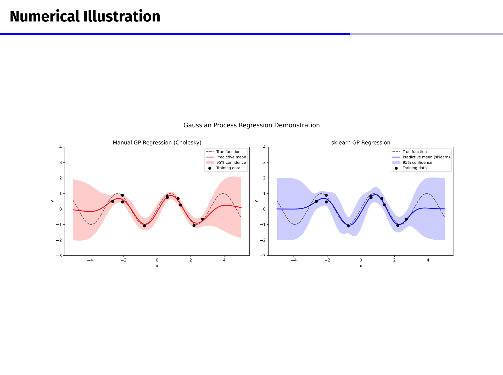
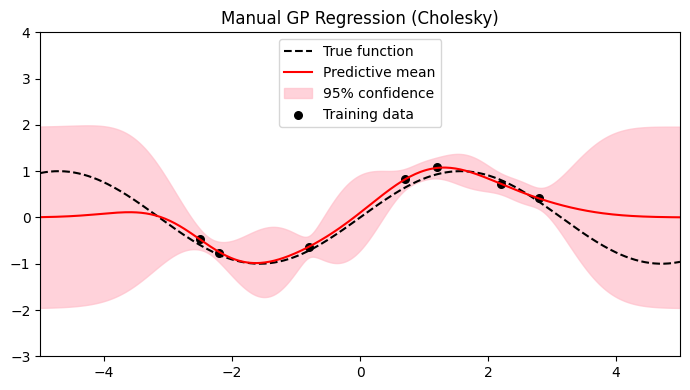
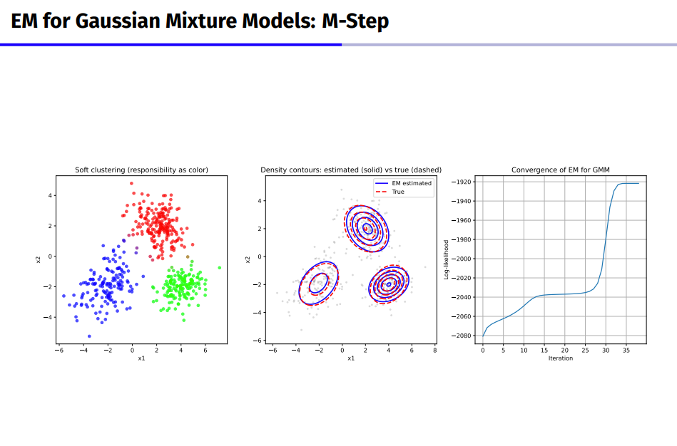
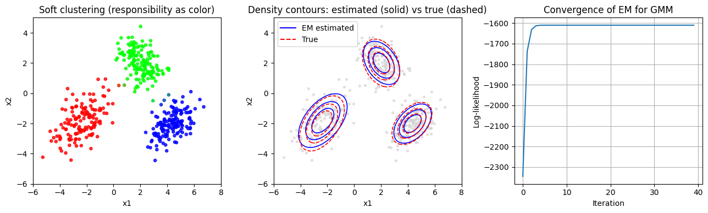
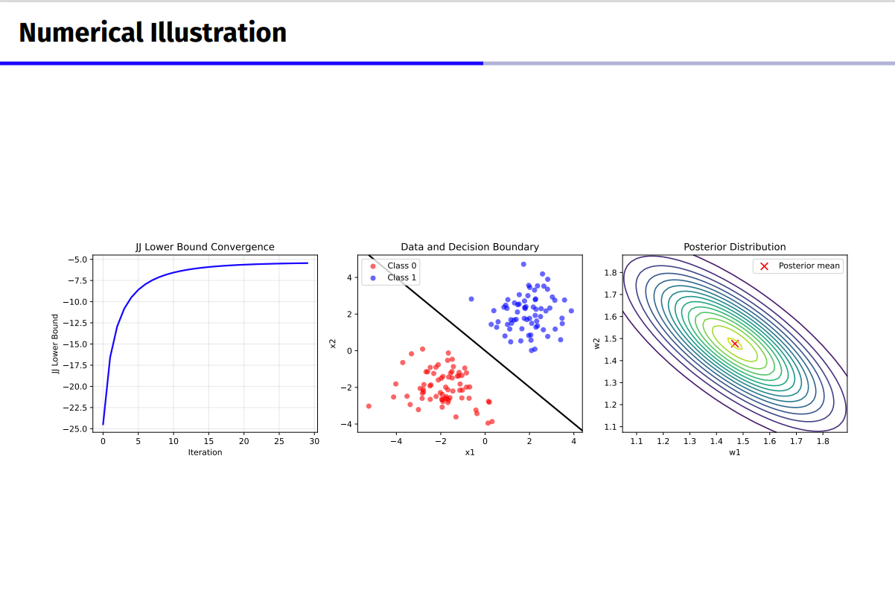
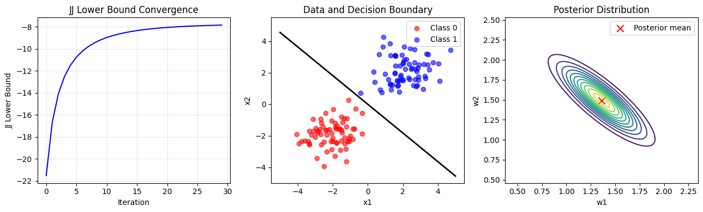

> [!FAQ] 1 (10 pts)
> Show that representer theorem still holds when there is bias. That is, the solution to
> $$
> \min_{f,b}\frac{1}{n}\sum_{i=1}^n \ell(y_i,f(x_i)+b)+\frac{\lambda}{2}\lVert f \rVert_H^2
> $$
> takes the form
> $$
> \sum_{i=1}^n \alpha_i k(\cdot,x_i)+b,\qquad \alpha\in\mathbb R^n.
> $$

**第一步：先把 $f$ 分成两部分**

设

$$
V=\operatorname{span}\{k(\cdot,x_1),\ldots,k(\cdot,x_n)\}
$$

因为 $V$ 是由有限个函数张成的子空间，所以 $V$ 是有限维的，因此是闭子空间。又因为 $H$ 是 Hilbert space，所以任意 $f\in H$ 都可以写成

$$
f=f_V+f_\perp
$$

其中 $f_V\in V$，并且 $f_\perp\perp V$。

**第二步：看 $f_\perp$ 对训练点有没有影响**

RKHS 里有 reproducing property：

$$
f(x_i)=\langle f,k(\cdot,x_i)\rangle_H
$$

因为 $k(\cdot,x_i)\in V$，而 $f_\perp\perp V$，所以

$$
f_\perp(x_i)=\langle f_\perp,k(\cdot,x_i)\rangle_H = 0
$$

于是对每个训练点都有

$$
f(x_i)=f_V(x_i)+f_\perp(x_i)=f_V(x_i)
$$

所以 loss 这一项不变：

$$
\ell(y_i,f(x_i)+b)=\ell(y_i,f_V(x_i)+b)
$$

这里的 $b$ 只是整体加上的 bias，不影响上面的正交分解。

**第三步：比较正则项**

因为 $f_V\perp f_\perp$，所以

$$
\lVert f\rVert_H^2
=
\lVert f_V\rVert_H^2+\lVert f_\perp\rVert_H^2
$$

把 $f$ 换成 $f_V$ 以后，经验风险不变，但正则项不会变大：

$$
\begin{aligned}
\frac{\lambda}{2}\lVert f\rVert_H^2
-
\frac{\lambda}{2}\lVert f_V\rVert_H^2
&=
\frac{\lambda}{2}
\left(
\lVert f_V\rVert_H^2+\lVert f_\perp\rVert_H^2
\right)
-
\frac{\lambda}{2}\lVert f_V\rVert_H^2 \\
&=
\frac{\lambda}{2}\lVert f_\perp\rVert_H^2 \\
&\ge 0
\end{aligned}
$$

如果 $f_\perp\neq 0$，而且 $\lambda>0$，目标函数还会更大。所以最优解里不需要 $f_\perp$ 这一部分。如果 $\lambda>0$，那么任何带有 $f_\perp\neq 0$ 的解都不可能是最优解，所以最优解必须满足 $f_\perp=0$

**第四步：写出最优解形式**

所以最优的 $f$ 一定在 $V$ 里面，也就是

$$

f^*(\cdot)=\sum_{i=1}^n \alpha_i k(\cdot,x_i)

$$

所以带 bias 的预测函数为

$$

f^*(x)+b^*=\sum_{i=1}^n \alpha_i k(x,x_i)+b^*

$$

其中 $\alpha\in\mathbb R^n$，$b^*\in\mathbb R$。


---

> [!FAQ] 2 (10 pts)
> Reproduce the figure, the left one, on page 52 of Lecture 4 about the Gaussian process. You are required to implement the details rather than directly using the package. The true function is a sin function.


lecture 4 的 52 页图

**第一步：先设真实函数和训练数据**

题目说 true function 是 sin function，所以取

$$
f(x)=\sin x
$$

训练数据是从这个函数上取一些点，再加一点 Gaussian noise：

$$
y_i=\sin(x_i)+\varepsilon_i,\qquad \varepsilon_i\sim N(0,\sigma_n^2)
$$

**第二步：写出 Gaussian process 用的 kernel**

这里不用现成的 Gaussian process package，直接手写 RBF kernel：

$$
k(x,x')=\sigma_f^2\exp\left(-\frac{(x-x')^2}{2l^2}\right)
$$

其中 $l$ 是 length scale，$\sigma_f^2$ 控制函数整体变化幅度。

**第三步：写 posterior mean 和 covariance**

设训练输入是 $X$，训练输出是 $y$，测试点是 $X_*$。先写训练点之间的 kernel matrix：

$$
K=K(X,X)+\sigma_n^2I
$$

GP regression 的 posterior mean 和 posterior covariance 是

$$
\begin{aligned}
\mu_* &= K(X_*,X)K^{-1}y \\
\Sigma_* &= K(X_*,X_*)-K(X_*,X)K^{-1}K(X,X_*)
\end{aligned}
$$

代码里没有直接算 $K^{-1}$，而是用 Cholesky decomposition 解线性方程。

**第四步：写代码复现图**

```python
import numpy as np
import matplotlib.pyplot as plt

np.random.seed(0)

def true_function(x):
    return np.sin(x)

def rbf_kernel(x1, x2, length_scale=0.8, sigma_f=1.0):
    x1 = np.asarray(x1).reshape(-1, 1)
    x2 = np.asarray(x2).reshape(-1, 1)

    dist2 = (x1 - x2.T) ** 2
    return sigma_f ** 2 * np.exp(-dist2 / (2 * length_scale ** 2))

# training data
X_train = np.array([-2.5, -2.2, -0.8, 0.7, 1.2, 2.2, 2.8])
y_train = true_function(X_train) + np.random.normal(0, 0.08, size=X_train.shape)

# test points
X_test = np.linspace(-5, 5, 400)

# hyperparameters
length_scale = 0.8
sigma_f = 1.0
sigma_n = 0.12

# kernel matrices
K = rbf_kernel(X_train, X_train, length_scale, sigma_f)
K = K + sigma_n ** 2 * np.eye(len(X_train))

K_s = rbf_kernel(X_train, X_test, length_scale, sigma_f)
K_ss = rbf_kernel(X_test, X_test, length_scale, sigma_f)

# Cholesky decomposition
L = np.linalg.cholesky(K + 1e-8 * np.eye(len(X_train)))

# solve K^{-1} y using Cholesky
alpha = np.linalg.solve(L.T, np.linalg.solve(L, y_train))

# posterior mean
mu = K_s.T @ alpha

# posterior covariance
v = np.linalg.solve(L, K_s)
cov = K_ss - v.T @ v

std = np.sqrt(np.maximum(np.diag(cov), 0))

# plot
plt.figure(figsize=(7, 4))

plt.plot(X_test, true_function(X_test), "k--", label="True function")
plt.plot(X_test, mu, "r", label="Predictive mean")

plt.fill_between(
    X_test,
    mu - 1.96 * std,
    mu + 1.96 * std,
    color="pink",
    alpha=0.7,
    label="95% confidence"
)

plt.scatter(X_train, y_train, c="black", s=30, label="Training data")

plt.xlim(-5, 5)
plt.ylim(-3, 4)

plt.title("Manual GP Regression (Cholesky)")
plt.legend()
plt.tight_layout()
plt.show()
```



黑色虚线是真函数 $\sin x$，黑色点是训练数据，红色线是 GP posterior mean，粉色区域是 posterior mean 上下大约 $1.96$ 个标准差的范围，也就是

$$
\mu_*\pm 1.96\sqrt{\operatorname{diag}(\Sigma_*)}
$$

在训练点附近，posterior uncertainty 比较小；在离训练点较远或者训练点比较稀疏的地方，uncertainty 会变大。


---

> [!FAQ] 3 (10 pts)
> In Lecture 6, we mentioned that “EM can be viewed as coordinate ascent on the ELBO.” Prove this fact rigorously.

**第一步：先写出 ELBO**

设观测变量是 $x$，隐变量是 $z$，参数是 $\theta$。对任意 density $q(z)$，ELBO 定义为

$$
\mathcal L(q,\theta)
=
E_q[\log p_\theta(x,z)]-E_q[\log q(z)]
$$

这里 $q(z)$ 是我们人为引入的一个分布，后面 E-step 就是在更新它。

**第二步：把 log likelihood 和 ELBO 联系起来**

先写 KL divergence：

$$
\operatorname{KL}(q(z)\|p_\theta(z\mid x))
=
E_q\left[
\log\frac{q(z)}{p_\theta(z\mid x)}
\right]
\ge 0
$$


又因为 posterior 可以写成

$$
p_\theta(z\mid x)=\frac{p_\theta(x,z)}{p_\theta(x)}
$$

所以代入 KL 里面：

$$
\begin{aligned}
\operatorname{KL}(q(z)\|p_\theta(z\mid x))
&=
E_q[\log q(z)-\log p_\theta(z\mid x)] \\
&=
E_q[\log q(z)-\log p_\theta(x,z)+\log p_\theta(x)] \\
&=
E_q[\log q(z)]-E_q[\log p_\theta(x,z)]+\log p_\theta(x) \\
&=
\log p_\theta(x)-\mathcal L(q,\theta)
\end{aligned}
$$

所以得到

$$
\log p_\theta(x)
=
\mathcal L(q,\theta)
+
\operatorname{KL}(q(z)\|p_\theta(z\mid x))
$$

因为 KL 总是非负的，所以 $\mathcal L(q,\theta)$ 确实是 $\log p_\theta(x)$ 的 lower bound。


**第三步：看 E-step 是不是在优化 $q$**

固定当前参数 $\theta^{(t)}$。这时候 $\log p_{\theta^{(t)}}(x)$ 和 $q$ 没关系。

由上面的分解式：

$$
\log p_{\theta^{(t)}}(x)
=
\mathcal L(q,\theta^{(t)})
+
\operatorname{KL}(q(z)\|p_{\theta^{(t)}}(z|x))
$$

所以在固定 $\theta^{(t)}$ 时，最大化 $\mathcal L(q,\theta^{(t)})$，就等价于最小化

$$
\operatorname{KL}(q(z)\|p_{\theta^{(t)}}(z|x))
$$

KL 的最小值是 $0$，达到最小值时有

$$
q^{(t+1)}(z)=p_{\theta^{(t)}}(z|x)
$$

这正好就是 EM 的 E-step：在当前参数 $\theta^{(t)}$ 下，计算隐变量的 posterior。

**第四步：看 M-step 是不是在优化 $\theta$**

现在固定刚刚得到的 $q^{(t+1)}$，然后优化 $\theta$。

ELBO 是

$$
\mathcal L(q^{(t+1)},\theta)
=
E_{q^{(t+1)}}[\log p_\theta(x,z)]
-
E_{q^{(t+1)}}[\log q^{(t+1)}(z)]
$$
第二项

$$
E_{q^{(t+1)}}[\log q^{(t+1)}(z)]
$$

和 $\theta$ 没有关系，所以优化 $\theta$ 时只需要优化

$$
E_{q^{(t+1)}}[\log p_\theta(x,z)]
$$

因为 E-step 已经给出

$$
q^{(t+1)}(z)=p_{\theta^{(t)}}(z|x)
$$

所以这项也可以写成 EM 里常见的 $Q$ 函数：

$$
Q(\theta,\theta^{(t)})
=
E_{p_{\theta^{(t)}}(z|x)}[\log p_\theta(x,z)]
$$

所以 M-step 就是在固定 $q$ 的情况下，对 $\theta$ 做最大化。

**第五步：检查 log likelihood 不会下降**

E-step 后有

$$
q^{(t+1)}(z)=p_{\theta^{(t)}}(z\mid x)
$$

所以这个时候 KL 为 $0$，于是

$$
\mathcal L(q^{(t+1)},\theta^{(t)})
=
\log p_{\theta^{(t)}}(x)
$$

M-step 选择新的参数 $\theta^{(t+1)}$，使

$$
\theta^{(t+1)}
\in
\arg\max_\theta \mathcal L(q^{(t+1)},\theta)
$$

因此 ELBO 不会变小：

$$
\mathcal L(q^{(t+1)},\theta^{(t+1)})
\ge
\mathcal L(q^{(t+1)},\theta^{(t)})
$$

又因为 ELBO 总是 log likelihood 的 lower bound，所以

$$
\log p_{\theta^{(t+1)}}(x)
\ge
\mathcal L(q^{(t+1)},\theta^{(t+1)})
$$

把这几个式子连起来：

$$
\begin{aligned}
\log p_{\theta^{(t+1)}}(x)
&\ge
\mathcal L(q^{(t+1)},\theta^{(t+1)}) \\
&\ge
\mathcal L(q^{(t+1)},\theta^{(t)}) \\
&=
\log p_{\theta^{(t)}}(x)
\end{aligned}
$$

所以 EM 每一步都不会让 log likelihood 下降。

同时，从更新方式上看，E-step 是固定 $\theta$ 优化 $q$，M-step 是固定 $q$ 优化 $\theta$。所以 EM 可以看成是在 ELBO $\mathcal L(q,\theta)$ 上做 coordinate ascent。

---

> [!FAQ] 4 (20 pts)
> Reproduce the figure on page 13 of Lecture 5 about EM for Gaussian Mixture Models. You are required to implement the details rather than directly using the package.


lecture 5 的 13 页

**第一步：先写出 Gaussian Mixture Model**

这里用二维数据复现图。设一共有 $K$ 个 Gaussian component，每个数据点 $x_i$ 的 density 是

$$
p(x_i)=\sum_{k=1}^K \pi_k N(x_i\mid \mu_k,\Sigma_k)
$$

其中 $\pi_k$ 是第 $k$ 个 Gaussian 的 mixing weight，并且满足

$$
\sum_{k=1}^K \pi_k=1
$$

本题里按照图的样子取 $K=3$，也就是三团二维 Gaussian 数据。

**第二步：E-step 计算 responsibility**

先写 Bayes rule 形式的 responsibility：

$$
r_{ik} = p(z_i=k\mid x_i)
$$


代入 GMM 以后得到

$$
r_{ik} = \frac{\pi_k N(x_i\mid \mu_k,\Sigma_k)}
{\sum_{j=1}^K \pi_j N(x_i\mid \mu_j,\Sigma_j)}
$$

这里 $r_{ik}$ 表示第 $i$ 个点属于第 $k$ 个 component 的程度。图左边的 soft clustering 就是用这个 responsibility 来上色。

**第三步：M-step 更新参数**

先记每个 component 的有效样本数为

$$
N_k=\sum_{i=1}^n r_{ik}
$$

然后用 responsibility 加权更新参数：

$$
\begin{aligned}
\pi_k &= \frac{N_k}{n} \\
\mu_k &= \frac{1}{N_k}\sum_{i=1}^n r_{ik}x_i \\
\Sigma_k &= \frac{1}{N_k}\sum_{i=1}^n r_{ik}(x_i-\mu_k)(x_i-\mu_k)^T
\end{aligned}
$$

这几步反复做，就得到 EM algorithm。

**第四步：记录 log likelihood**

为了画右边的 convergence 图，每一轮记录 log likelihood：

$$

\log p(X)

=\sum_{i=1}^n

\log

\left(

\sum_{k=1}^K

\pi_k N(x_i\mid \mu_k,\Sigma_k)

\right)

$$

如果 EM 的实现正确，这个值应该随着 iteration 不下降。

**第五步：写代码复现图**

```python
import numpy as np
import matplotlib.pyplot as plt
from matplotlib.lines import Line2D

rng = np.random.default_rng(0)

# -----------------------------
# 1. Generate true GMM data
# -----------------------------

K = 3
n = 450

true_pi = np.array([0.34, 0.33, 0.33])

true_means = np.array([
    [-2.4, -2.0],
    [2.0, 2.0],
    [4.3, -2.0]
])

true_covs = np.array([
    [[1.0, 0.55],
     [0.55, 1.2]],

    [[0.7, -0.25],
     [-0.25, 0.9]],

    [[0.8, 0.35],
     [0.35, 0.7]]
])

counts = rng.multinomial(n, true_pi)

X_parts = []
true_labels = []

for k in range(K):
    X_k = rng.multivariate_normal(
        mean=true_means[k],
        cov=true_covs[k],
        size=counts[k]
    )
    X_parts.append(X_k)
    true_labels.extend([k] * counts[k])

X = np.vstack(X_parts)
true_labels = np.array(true_labels)

# shuffle data
perm = rng.permutation(n)
X = X[perm]
true_labels = true_labels[perm]

# -----------------------------
# 2. Helper functions
# -----------------------------

def log_mvn_pdf(X, mean, cov):
    d = X.shape[1]
    diff = X - mean

    sign, logdet = np.linalg.slogdet(cov)
    inv_cov = np.linalg.inv(cov)

    quad = np.sum((diff @ inv_cov) * diff, axis=1)

    return -0.5 * (d * np.log(2 * np.pi) + logdet + quad)

def logsumexp(A, axis=1):
    A_max = np.max(A, axis=axis, keepdims=True)
    return A_max + np.log(np.sum(np.exp(A - A_max), axis=axis, keepdims=True))

def e_step(X, pi, means, covs):
    n = X.shape[0]
    K = len(pi)

    log_prob = np.zeros((n, K))

    for k in range(K):
        log_prob[:, k] = np.log(pi[k] + 1e-16) + log_mvn_pdf(X, means[k], covs[k])

    log_norm = logsumexp(log_prob, axis=1)
    resp = np.exp(log_prob - log_norm)

    log_likelihood = np.sum(log_norm)

    return resp, log_likelihood

def m_step(X, resp):
    n, d = X.shape
    K = resp.shape[1]

    Nk = np.sum(resp, axis=0) + 1e-16

    pi = Nk / n
    means = (resp.T @ X) / Nk[:, None]

    covs = np.zeros((K, d, d))

    for k in range(K):
        diff = X - means[k]
        covs[k] = (resp[:, k][:, None] * diff).T @ diff / Nk[k]
        covs[k] += 1e-6 * np.eye(d)

    return pi, means, covs

# -----------------------------
# 3. Initialize parameters
# -----------------------------

pi = np.ones(K) / K

means = np.array([
    [-4.5, -3.5],
    [0.5, 3.5],
    [5.5, -3.5]
])

base_cov = np.cov(X.T) + 1e-3 * np.eye(2)
covs = np.array([base_cov.copy() for _ in range(K)])

log_likelihoods = []

# -----------------------------
# 4. Run EM
# -----------------------------

num_iters = 40

for t in range(num_iters):
    resp, ll = e_step(X, pi, means, covs)
    log_likelihoods.append(ll)

    pi, means, covs = m_step(X, resp)

# final E-step for final responsibility
resp, ll = e_step(X, pi, means, covs)

# -----------------------------
# 5. Plot
# -----------------------------

fig, axes = plt.subplots(1, 3, figsize=(13, 4))

# Left: soft clustering
axes[0].scatter(
    X[:, 0],
    X[:, 1],
    c=resp,
    s=14,
    alpha=0.8
)

axes[0].set_title("Soft clustering (responsibility as color)")
axes[0].set_xlabel("x1")
axes[0].set_ylabel("x2")
axes[0].set_xlim(-6, 8)
axes[0].set_ylim(-6, 5)

# Middle: density contours
x_min, x_max = -6, 8
y_min, y_max = -6, 5

xx, yy = np.meshgrid(
    np.linspace(x_min, x_max, 250),
    np.linspace(y_min, y_max, 250)
)

grid = np.c_[xx.ravel(), yy.ravel()]

axes[1].scatter(
    X[:, 0],
    X[:, 1],
    c="lightgray",
    s=8,
    alpha=0.6
)

for k in range(K):
    # estimated contours
    z_est = np.exp(log_mvn_pdf(grid, means[k], covs[k])).reshape(xx.shape)
    levels_est = np.max(z_est) * np.array([0.25, 0.5, 0.75])

    axes[1].contour(
        xx,
        yy,
        z_est,
        levels=levels_est,
        colors="blue",
        linewidths=1.2
    )

    # true contours
    z_true = np.exp(log_mvn_pdf(grid, true_means[k], true_covs[k])).reshape(xx.shape)
    levels_true = np.max(z_true) * np.array([0.25, 0.5, 0.75])

    axes[1].contour(
        xx,
        yy,
        z_true,
        levels=levels_true,
        colors="red",
        linestyles="dashed",
        linewidths=1.2
    )

legend_lines = [
    Line2D([0], [0], color="blue", lw=1.5, label="EM estimated"),
    Line2D([0], [0], color="red", lw=1.5, linestyle="--", label="True")
]

axes[1].legend(handles=legend_lines)
axes[1].set_title("Density contours: estimated (solid) vs true (dashed)")
axes[1].set_xlabel("x1")
axes[1].set_ylabel("x2")
axes[1].set_xlim(x_min, x_max)
axes[1].set_ylim(y_min, y_max)

# Right: log-likelihood convergence
axes[2].plot(np.arange(num_iters), log_likelihoods)
axes[2].set_title("Convergence of EM for GMM")
axes[2].set_xlabel("Iteration")
axes[2].set_ylabel("Log-likelihood")
axes[2].grid(True)

plt.tight_layout()
plt.savefig("q4_gmm_em.png", dpi=200)
plt.show()
```




左边的图是 soft clustering。每个点的颜色由最后一轮 E-step 得到的 responsibility 决定。因为这三个 Gaussian cluster 分得比较开，所以大部分点的 responsibility 接近 $0$ 或 $1$，图上看起来颜色也比较接近硬分类。

中间的图是在比较 estimated Gaussian 和 true Gaussian。灰色点是训练数据，蓝色实线是 EM 最后估计出的 Gaussian density contour，红色虚线是生成数据时真正用的 Gaussian density contour。可以看到三组蓝色轮廓和红色轮廓基本重合，说明 EM 最后估计出的均值和 covariance 比较接近真实参数。

右边的图是每一轮 EM 的 log likelihood。开始几轮 log likelihood 上升得很快，后面逐渐变平，说明参数已经接近收敛。整个曲线没有下降，也符合 EM 每一步不会降低 log likelihood 的性质。


---
> [!FAQ] 5 (10 pts)
> Given a non-negative function $\tilde p(w)$, consider the following variational problem
> $$
> \max_q L(q)=E_q[\log \tilde p(w)]-E_q[\log q(w)],
> $$
> where $q(w)$ is an arbitrary probability density. Show the solution is given by
> $$
> q^*(w)=\frac{\tilde p(w)}{\int \tilde p(w)\,dw}.
> $$

**第一步：先把 $\tilde p(w)$ 归一化**

设

$$
Z=\int \tilde p(w)\,dw
$$

这里需要假设 $0<Z<\infty$。定义

$$
p(w)=\frac{\tilde p(w)}{Z}
$$

也就是

$$
\tilde p(w)=Zp(w)
$$

**第二步：把目标函数改写成 KL 的形式**

这里用 KL divergence 的非负性：

$$
\operatorname{KL}(q\|p)
=

E_q\left[\log\frac{q(w)}{p(w)}\right]
\ge 0
$$

目标函数是

$$
L(q)=E_q[\log \tilde p(w)]-E_q[\log q(w)]
$$

代入 $\tilde p(w)=Zp(w)$：

$$
\begin{aligned}
L(q)
&=E_q[\log Z+\log p(w)]-E_q[\log q(w)] \\
&=\log Z+E_q[\log p(w)]-E_q[\log q(w)] \\
&=\log Z-E_q\left[\log\frac{q(w)}{p(w)}\right] \\
&=\log Z-\operatorname{KL}(q|p)
\end{aligned}
$$

**第三步：找最大值**

因为

$$
\operatorname{KL}(q\|p)\ge 0
$$

所以

$$
L(q)\le \log Z
$$

等号成立当且仅当

$$
q(w)=p(w)
$$

于是最优解是

$$
q^*(w)=p(w)=\frac{\tilde p(w)}{\int \tilde p(w)\,dw}
$$

---

> [!FAQ] 6 (10 pts)
> Reproduce the figure on page 22 of Lecture 6 about the variational logistic regression. You are required to implement the details rather than directly using the package.


lecture 6 的 22 页

图里画的是二维数据，所以令

$$ x_i= \begin{bmatrix} x_{i1} \\ x_{i2} \end{bmatrix}, \qquad w= \begin{bmatrix} w_1 \\ w_2 \end{bmatrix} $$

图里的 posterior 只画了 $w_1,w_2$，所以这里不额外加 bias。设标签是 $t_i\in\{0,1\}$，为了写公式方便，把它改成 

$$ y_i=2t_i-1 $$

这样 $y_i\in\{-1,1\}$。Logistic regression 可以写成

$$ p(y_i\mid x_i,w)=\sigma(y_iw^Tx_i) $$

其中

$$ \sigma(a)=\frac{1}{1+\exp(-a)} $$

再给 $w$ 加一个 Gaussian prior：

$$ p(w)=\mathcal N(w\mid 0,\alpha^{-1}I) $$

**第二步：写 Jaakkola-Jordan lower bound**

直接处理 $\log\sigma(y_iw^Tx_i)$ 不太方便，所以给每个样本引入一个 variational parameter $\xi_i$。

先写用到的 lower bound：


$$ 
\log\sigma(a) \ge \log\sigma(\xi_i) +\frac{a-\xi_i}{2} -\lambda(\xi_i)(a^2-\xi_i^2) 
$$

其中

$$ \lambda(\xi_i) = \frac{\tanh(\xi_i/2)}{4\xi_i} $$

这里把

$$ a=y_iw^Tx_i $$

代入就可以。因为右边关于 $w$ 是二次函数，所以后面得到的 $q(w)$ 会是 Gaussian。

**第三步：写出 $q(w)$ 的更新公式**

设

$$ q(w)=\mathcal N(w\mid m,S) $$

根据上面的二次 lower bound，可以得到

$$ 
S^{-1} = \alpha I + 2\sum_{i=1}^n \lambda(\xi_i)x_ix_i^T 
$$

并且

$$ 
m = S\left(\frac{1}{2}\sum_{i=1}^n y_ix_i\right) 
$$

更新 $\xi_i$ 时，用到

$$ 
E_q[ww^T]=S+mm^T 
$$

所以

$$ 
\xi_i^2 = x_i^T(S+mm^T)x_i 
$$

实际代码里就是反复更新 $m,S,\xi$，并记录每一轮的 JJ lower bound。

**第四步：写代码复现图**

```python
import numpy as np
import matplotlib.pyplot as plt

rng = np.random.default_rng(0)

# -----------------------------
# 1. Make two-class 2D data
# -----------------------------

n0 = 70
n1 = 70

mean0 = np.array([-2.0, -2.0])
mean1 = np.array([2.0, 2.0])

cov0 = np.array([
    [0.75, 0.15],
    [0.15, 0.75]
])

cov1 = np.array([
    [0.75, 0.15],
    [0.15, 0.75]
])

X0 = rng.multivariate_normal(mean0, cov0, size=n0)
X1 = rng.multivariate_normal(mean1, cov1, size=n1)

X = np.vstack([X0, X1])

# t is used for plotting, y is used in the formula
t = np.concatenate([np.zeros(n0), np.ones(n1)])
y = 2 * t - 1

n, d = X.shape

# -----------------------------
# 2. Helper functions
# -----------------------------

def sigmoid(a):
    return 1.0 / (1.0 + np.exp(-a))

def log_sigmoid(a):
    return -np.logaddexp(0, -a)

def jj_lambda(xi):
    xi = np.asarray(xi)
    out = np.zeros_like(xi, dtype=float)

    small = np.abs(xi) < 1e-8
    out[small] = 1.0 / 8.0
    out[~small] = np.tanh(xi[~small] / 2.0) / (4.0 * xi[~small])

    return out

def update_q(X, y, xi, alpha):
    n, d = X.shape
    lam = jj_lambda(xi)

    A = alpha * np.eye(d) + 2.0 * X.T @ (lam[:, None] * X)
    S = np.linalg.inv(A)

    b = 0.5 * X.T @ y
    m = S @ b

    return m, S

def update_xi(X, m, S):
    second_moment = S + np.outer(m, m)
    xi2 = np.sum((X @ second_moment) * X, axis=1)
    xi = np.sqrt(np.maximum(xi2, 1e-12))
    return xi

def jj_lower_bound(X, y, xi, m, S, alpha):
    n, d = X.shape
    lam = jj_lambda(xi)

    second_moment = S + np.outer(m, m)

    Ea = y * (X @ m)
    Ea2 = np.sum((X @ second_moment) * X, axis=1)

    prior_term = (
        0.5 * d * np.log(alpha)
        - 0.5 * d * np.log(2 * np.pi)
        - 0.5 * alpha * (np.trace(S) + m @ m)
    )

    likelihood_bound = np.sum(
        log_sigmoid(xi)
        + 0.5 * (Ea - xi)
        - lam * (Ea2 - xi ** 2)
    )

    sign, logdet_S = np.linalg.slogdet(S)

    entropy = 0.5 * (
        d * (1.0 + np.log(2 * np.pi))
        + logdet_S
    )

    return prior_term + likelihood_bound + entropy

def mvn_pdf(points, mean, cov):
    d = points.shape[1]
    diff = points - mean

    inv_cov = np.linalg.inv(cov)
    sign, logdet = np.linalg.slogdet(cov)

    quad = np.sum((diff @ inv_cov) * diff, axis=1)

    return np.exp(
        -0.5 * (d * np.log(2 * np.pi) + logdet + quad)
    )

# -----------------------------
# 3. Variational inference
# -----------------------------

alpha = 1.0
xi = np.ones(n)

lower_bounds = []
num_iters = 30

for it in range(num_iters):
    m, S = update_q(X, y, xi, alpha)
    xi = update_xi(X, m, S)

    # recompute q after updating xi
    m, S = update_q(X, y, xi, alpha)

    lb = jj_lower_bound(X, y, xi, m, S, alpha)
    lower_bounds.append(lb)

# -----------------------------
# 4. Plot the three figures
# -----------------------------

fig, axes = plt.subplots(1, 3, figsize=(13, 4))

# Left: JJ lower bound convergence
axes[0].plot(np.arange(num_iters), lower_bounds, color="blue")
axes[0].set_title("JJ Lower Bound Convergence")
axes[0].set_xlabel("Iteration")
axes[0].set_ylabel("JJ Lower Bound")
axes[0].grid(True, alpha=0.3)

# Middle: data and decision boundary
axes[1].scatter(X0[:, 0], X0[:, 1], color="red", alpha=0.6, label="Class 0")
axes[1].scatter(X1[:, 0], X1[:, 1], color="blue", alpha=0.6, label="Class 1")

x_line = np.linspace(-5, 5, 200)

# decision boundary: m_1 x_1 + m_2 x_2 = 0
if abs(m[1]) > 1e-12:
    y_line = -(m[0] / m[1]) * x_line
    axes[1].plot(x_line, y_line, color="black", linewidth=2)
else:
    axes[1].axvline(0, color="black", linewidth=2)

axes[1].set_title("Data and Decision Boundary")
axes[1].set_xlabel("x1")
axes[1].set_ylabel("x2")
axes[1].legend()
axes[1].set_xlim(-5.5, 5.5)
axes[1].set_ylim(-5.0, 5.5)

# Right: posterior distribution q(w)
std1 = np.sqrt(S[0, 0])
std2 = np.sqrt(S[1, 1])

w1_grid = np.linspace(m[0] - 4 * std1, m[0] + 4 * std1, 200)
w2_grid = np.linspace(m[1] - 4 * std2, m[1] + 4 * std2, 200)

W1, W2 = np.meshgrid(w1_grid, w2_grid)
points = np.c_[W1.ravel(), W2.ravel()]

Z = mvn_pdf(points, m, S).reshape(W1.shape)

axes[2].contour(W1, W2, Z, levels=12)
axes[2].scatter(
    m[0],
    m[1],
    marker="x",
    color="red",
    s=80,
    label="Posterior mean"
)

axes[2].set_title("Posterior Distribution")
axes[2].set_xlabel("w1")
axes[2].set_ylabel("w2")
axes[2].legend()

plt.tight_layout()
plt.savefig("q6_variational_logistic_regression.png", dpi=200)
plt.show()
```



左边的图是 JJ lower bound 随 iteration 的变化。可以看到一开始 lower bound 上升很快，后面逐渐变平，说明 variational update 已经接近收敛。这个趋势也说明每一轮更新都在把 lower bound 往更大的方向推。

中间的图是二维训练数据和 decision boundary。红色点是 class 0，蓝色点是 class 1。黑色直线是用 posterior mean $m$ 画出来的分类边界。因为这里没有额外加入 bias，所以 decision boundary 是

$$
m_1x_1+m_2x_2=0
$$

从图上看，这条直线基本把左下角的红色点和右上角的蓝色点分开。

右边的图是 posterior distribution $q(w)=N(w\mid m,S)$。等高线表示 $w_1,w_2$ 的 posterior density，红色叉号是 posterior mean。可以看到 posterior mean 落在等高线中心附近，并且 $w_1,w_2$ 都是正的，所以中间图里的分类边界斜率是负的，能够把两类数据分开。

---
