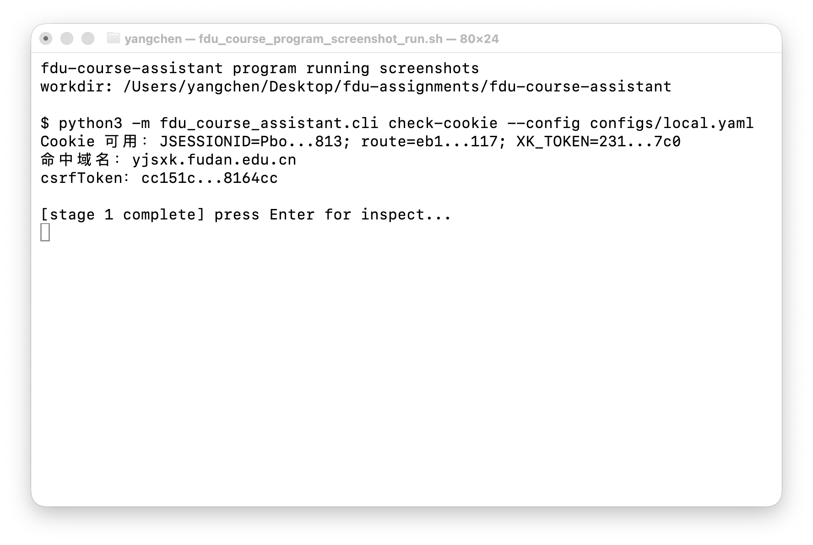
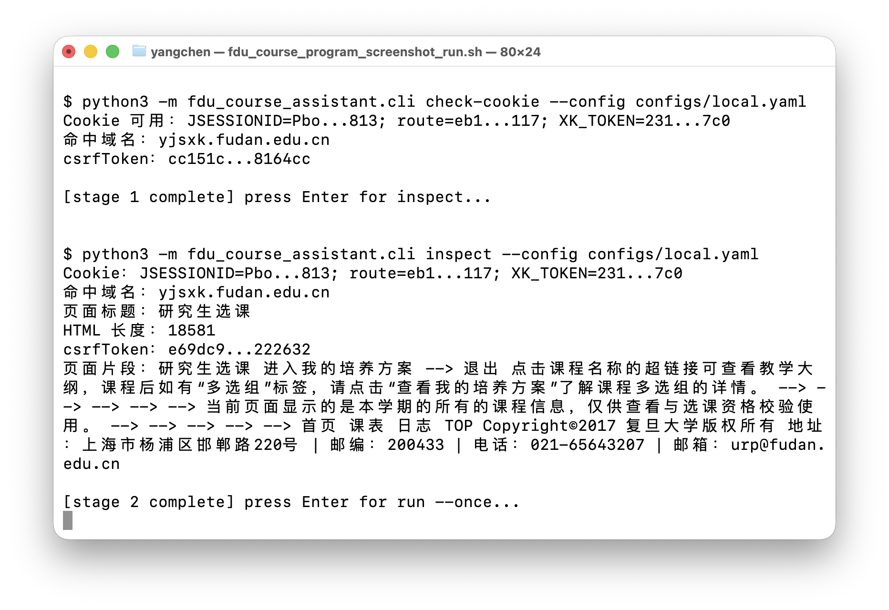
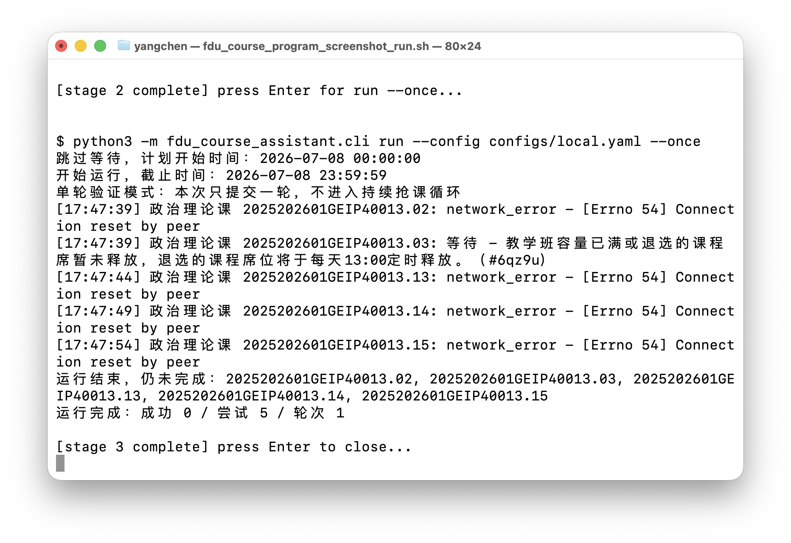

# fdu-course-assistant

这是一个面向复旦研究生选课系统的实战抢课脚本。它不替代网页登录：先由你在浏览器里正常登录，脚本再复用这次登录得到的 Cookie，进入选课页提取 `csrfToken`，最后按配置向选课接口提交教学班代码。

本项目只保存代码、模板和脱敏示例，不保存真实 Cookie、姓名、学号或原始请求头。真实配置文件 `configs/local.yaml` 已被 `.gitignore` 忽略，只留在本机。

## 先理解三个概念

- Cookie：浏览器登录后带在请求头里的登录凭据。脚本靠它证明“你已经登录”。不要提交到 Git，不要写进 README。
- `csrfToken`：选课页里的防伪 token。脚本会自动从登录后的选课页提取，不需要手填。
- 教学班代码：配置文件 `ids` 里要填的值，接口字段名叫 `bjdm`。它是某个教学班的编号，例如 `2025202601GEIP40013.02`，不是课程名称，也不是培养方案里的课程号。

## 安装

进入项目目录：

```bash
cd /Users/yangchen/Desktop/fdu-assignments/fdu-course-assistant
```

推荐安装成命令行工具：

```bash
python3 -m pip install -e .
```

安装后可以直接使用：

```bash
fdu-course --help
```

如果不想安装，也可以用模块方式运行：

```bash
PYTHONPATH=src python3 -m fdu_course_assistant.cli --help
```

## 实战流程

### 1. 准备本地配置

```bash
cp configs/local.example.yaml configs/local.yaml
```

打开 `configs/local.yaml`，重点改 `start_at`、`end_at`、`courses`。模板里的教学班代码只是格式示例，实战时必须换成你要抢的教学班代码。

```yaml
targets:
  - yjsxk.fudan.edu.cn
  - yjsxk.fudan.sh.cn
cookie_env: FDU_XK_COOKIE
start_at: "12:57:30"
end_at: "13:10:30"
poll_interval_seconds: 0.3
courses:
  - category: 政治理论课
    ids:
      - "2025202601GEIP40013.02"
      - "2025202601GEIP40013.03"
```

### 2. 登录并复制 Cookie

在浏览器打开选课系统并完成登录。登录后打开 DevTools → Network，刷新选课页，点任意一个 `yjsxk.fudan.edu.cn` 或 `yjsxk.fudan.sh.cn` 请求，在 Request Headers 里复制整行 `Cookie`。

把 Cookie 放进环境变量，不要写进配置文件：

```bash
export FDU_XK_COOKIE='浏览器 Request Headers 里的整行 Cookie'
```

### 3. 先做只读检查

这两条命令只检查登录态、域名和 token，不提交课程：

```bash
fdu-course check-cookie --config configs/local.yaml
fdu-course inspect --config configs/local.yaml
```

确认输出里能看到命中的域名，并且能提取到截断显示的 `csrfToken`。

### 4. 单轮提交验证

这一步会真实调用选课提交接口，但只跑一轮，不会持续循环：

```bash
fdu-course run --config configs/local.yaml --once
```

用它确认 Cookie、域名、课程类别和教学班代码是否能组成完整请求链路。

### 5. 按时间窗持续运行

确认配置无误后，再按 `start_at` / `end_at` 的时间窗持续运行：

```bash
fdu-course run --config configs/local.yaml
```

脚本会在开始时间前等待，到结束时间停止；某个教学班提交成功后，会从待提交列表里移除，避免继续重复提交同一个教学班。

## 配置字段说明

- `targets`：候选选课域名。默认保留两个域名，脚本会自动选择能提取 `csrfToken` 的那个。
- `cookie_env`：保存 Cookie 的环境变量名，默认 `FDU_XK_COOKIE`。
- `start_at` / `end_at`：运行时间窗，支持 `HH:MM:SS`，也支持 `YYYY-MM-DD HH:MM:SS`。
- `poll_interval_seconds`：每轮请求间隔，默认 `0.3` 秒。调试时可以设成 `1.0`。
- `courses[].category`：课程类别中文名，必须在“课程类别映射”里。
- `courses[].ids`：教学班代码列表，也就是接口字段 `bjdm`。

## 两个选课域名

选课系统常见入口有两个域名：

- `yjsxk.fudan.edu.cn`
- `yjsxk.fudan.sh.cn`

它们对应同一组选课路径：

- 取 token：`/yjsxkapp/sys/xsxkappfudan/xsxkHome/gotoChooseCourse.do`
- 提交课程：`/yjsxkapp/sys/xsxkappfudan/xsxkCourse/choiceCourse.do?_={timestamp}`

脚本会按 `targets` 顺序尝试，哪个域名能从选课页提取 `csrfToken`，本次就使用哪个域名提交。

## 课程类别映射

脚本内置课程类别映射：

- `学位基础课` / `专业选修课` / `学位专业课` → `lx=8`
- `公共选修课` → `lx=9`
- `第一外国语` / `政治理论课` / `专业外语` → `lx=7`

如果浏览器实际请求里的 `lx` 和这里不一致，以当前选课系统的实际请求为准，并同步更新代码里的映射。

## 实战截图

真实程序运行截图放在 `docs/screenshots/`。当前图片均来自 macOS Terminal 实际执行脚本过程，不是 mock 图、生成示意图或手工绘制的终端图。命令行没有显示原始 Cookie；输出中的 Cookie 和 `csrfToken` 只保留截断后的脱敏形式。

### 1. 检查 Cookie 和命中域名

真实运行：`python3 -m fdu_course_assistant.cli check-cookie --config configs/local.yaml`



### 2. 只读检查选课页

真实运行：`python3 -m fdu_course_assistant.cli inspect --config configs/local.yaml`



### 3. 单轮真实提交验证

真实运行：`python3 -m fdu_course_assistant.cli run --config configs/local.yaml --once`



## 其它文档

- 抓包字段说明：`docs/capture.md`
- 常见问题排查：`docs/debug.md`
- 代码结构说明：`docs/architecture.md`
- 截图说明：`docs/screenshots/README.md`

## 本地验证

```bash
uv run --with pytest pytest
PYTHONPATH=src python3 -m fdu_course_assistant.cli --help
PYTHONPATH=src python3 -m fdu_course_assistant.cli check-cookie --config configs/local.example.yaml
```

最后一条在未设置 `FDU_XK_COOKIE` 时应该明确提示设置环境变量。
